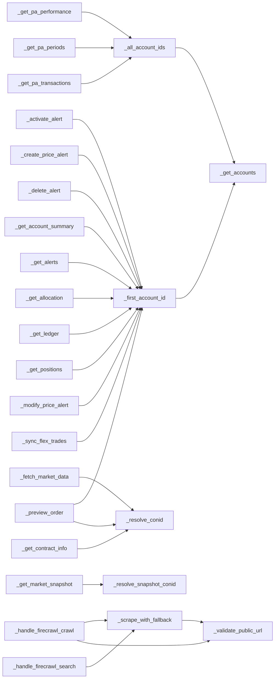

# claude_tools.py Audit — 2026-07

**Status:** SYNTHESIS COMPLETE (2026-07-02); D1 REFINED 2026-07-06 with a real before/after caching comparison — D2–D4 remain recommendations for future work; D5 applied 2026-07-02, extended with 3 more live-found fixes through 2026-07-06. Open evidence gaps: run 3 (optional, noise-reduction only), TradingView tool payload unmeasured (bridge offline), register items 5/6/10/12/13.
**Spec:** docs/2026-07-02-claude-tools-audit-design.md
**Model used for all token counts:** claude-opus-4-8 (ClaudIA default)

## Decision summary

| # | Decision | Outcome | Evidence |
|---|---|---|---|
| D1 | Where ClaudIA slowness comes from | **The Anthropic API stream, not the toolkit — confirmed by two runs, before and after prompt caching landed.** Stream share is ~91–93% of wall-clock in both conditions; tool handlers 7–8.5%; Chainlit/persistence 0.1% in both. **Caching (landed independently 2026-07-03) is a confirmed, large cost win — 82.4% reduction in effective input tokens for a comparable session — but not a confirmed latency win**: average ttft was higher with caching active (2.52s vs 1.62s), not lower, and stream share was unchanged. Root cause: generation time (long coaching responses, 4–25s/turn), not prompt processing, dominates wall-clock in both conditions — Claude's raw prompt-processing throughput was already sub-2s even on the full 20k+-token uncached prefix. **The only lever with a plausible path to reducing perceived slowness is response-length/verbosity policy.** | Appendix B |
| D2 | Split go/no-go + architecture | **No-go — defer the 7-module split; do helper extraction now (Candidate 1).** The graph is cleanly cuttable (DAG, 3 cross-domain edges, all via conid resolution) but the second criterion fails: the monolith is not actively causing defects — the one defect (`get_analytics` annualization) is a local missing-kwarg, and the consistency deviations are cured by unifying conid resolution + hoisting the dispatch dict without moving a file. Hold Candidate 2 for the first genuinely new tool domain; Candidate 3 rejected. | Appendices C, D, E |
| D3 | Tool-exposure strategy | **Keep sending all tools; no per-context profiles.** The tool surface (9,473 tok) is the *smaller* half of the static prefix (system prompt: 11,113 tok), so profiles attack the wrong half; the decided caching upgrade neutralizes the repeated-prefix cost entirely; and the live session showed zero wrong-tool selections across 19 calls. Revisit only if post-caching evidence shows wrong-tool picks or material cost. | Appendices A, B, E |
| D4 | Sequencing vs. scraping-RAG layer 2 | **Build layer 2 now, into the current single file.** Its 3 tools add +543 tokens (2.6% of the static prefix) — immaterial. They extend the existing web domain and are therefore *not* the arch-note's "first new domain" split trigger. Helper extraction (D2) can land before or alongside; neither blocks the other. | Appendices A, E |
| D5 | Documentation verdicts | **33 accurate / 8 fix / 1 enrich / 0 trim / 0 unverified** — applied to `claude_tools.py` in the companion commit (doc-text only). Reconciliation: Appendix C's `get_option_chain` "none" rated code *structure* only; Appendix G's non-functional-endpoint verdict governs the tool's real status. Live-session addendum (Appendix B): two findings exceed doc-text scope and become follow-up work items — `sync_flex_trades` silently verifying empty daily statements (data-integrity defect observed live), and `run_backtest`'s opaque error surface. | Appendices G, B |

**Follow-up register (out of this audit's scope, in priority order):** 1. ~~prompt caching in claudia_ui~~ **LANDED 2026-07-03 independently of this audit** (`claudia/agent.py` commits `bb77111`..`f68c43d` — 3 breakpoints: tools, system prompt, conversation history); **live-confirmed 2026-07-06, Appendix B run 2** — 82.4% input-token cost reduction, no confirmed latency change (see D1); 2. ~~Flex `_get_statement` poller fix~~ **FIXED 2026-07-02, commit 252729f; live-confirmed 2026-07-06** — first real sync imported 122/122 trades incl. the missing July 1–2 fills (July 1: +$2,957.00, July 2: +$94.50 — the true week P&L was **+$430.00**, not the −$2,621.50 reported from the stale store on 2026-07-02); 3. ~~live re-verification of `/iserver/account/trades` empty result~~ **RESOLVED 2026-07-06** — two-call warmup, origin coverage complete once primed; auto-retry fixed in `client.get_trades()` (see Appendix B finding 2); 4. ~~`get_analytics` periods fix~~ **FIXED 2026-07-02, commit 3fb22f4**; ~~`run_backtest` error-surface improvement~~ **FIXED 2026-07-03, commit 7559ff2** (handler returns sandbox error detail + df columns + signal contract; exception type included in the wrap; TDD with the live KeyError scenario); 5. helper extraction (D2 Candidate 1); 6. `get_option_chain` reimplementation via `secdef/search → strikes`; 7. ~~latency runs 2–3~~ **run 2 DONE 2026-07-06** (cached-state comparison, Appendix B — Run 2 is now the reference session; Run 1 retained only as the pre-caching baseline, see Appendix B note) — a "run 3" is optional and would compare against Run 2, not Run 1; 8. response-length policy experiment (D1 lever 2); 9. ~~"6 months → 84 bars" period-mapping check~~ **RESOLVED + FIXED 2026-07-06, commit c397428** — IBKR period strings are case-sensitive; uppercase ('6M', '1Y') silently falls back to ~84 bars. Client now lowercases period/bar; schema examples corrected to lowercase; 10. `preview_order` structural schema gap — no stop-price or `sec_type` field. **UPGRADED to confirmed functional defect, live-verified 2026-07-06**: called through the real handler (not a hand-rolled request), `order_type='STP'` and `'STOP_LIMIT'` both return **HTTP 500** (LMT and MKT succeed) — the handler's own whitelist admits these types but only populates `price` for `LMT`, so IBKR rejects the incomplete order and `_safe_error` reports a generic, unactionable message. No longer "beyond doc-text" — this needs a real code fix (add `stop_price`/schema field, map to `price`/`auxPrice` per type); 11. Appendix C minors not covered by helper extraction: ~~`get_positions` None-formatting `TypeError`~~ **FIXED 2026-07-03, commit 9a4181d (TDD)**; still open: private-API reach-ins in `diagnose_orders` (`client._get`) and `get_pa_periods` (`client._post`); 12. **sortino/calmar variant decision** (found 2026-07-02 while verifying analytics docs): `analytics.sortino` implements the simplified discrete form (std of below-target returns only) that the canonical source explicitly disfavors — canonical is target downside deviation over ALL observations (https://en.wikipedia.org/wiki/Sortino_ratio); `analytics.calmar` is whole-series, formally the MAR-ratio convention vs Young 1991's trailing-36-month Calmar (https://en.wikipedia.org/wiki/Calmar_ratio). Both variants now documented in docstrings; migrating changes every existing backtest figure — deliberate decision required, not a doc fix. 13. **`generate_pinescript` exposes only 1 of 3 pinescript.py capabilities** (found live 2026-07-06): `ibkr_core_mcp/pinescript.py` has `indicator_script()`, `strategy_from_signals()`, and `strategy_from_backtest()` — all three are part of the public Python API (documented in CLAUDE.md) — but `ClaudeToolkit._generate_pinescript` (claude_tools.py:1812) only ever calls `indicator_script()`. Live consequence: asked for a strategy script matching a just-run backtest, ClaudIA had no tool for it and hand-wrote PineScript v5 `strategy()` syntax from her own knowledge instead of calling the tested, deterministic generator — happened to be correct this time, but the tool gap creates a real syntax-hallucination surface. Fix: add a `strategy_name`/`from_backtest` path (or a second tool) wiring `strategy_from_backtest`/`strategy_from_signals` into the dispatch, matching the D5-corrected tool description's honesty about current scope.

## Next live session — verification checklist (planned 2026-07-03)

Owner-driven session with an authenticated gateway, preferably during US market hours
(RTH needed for items 4–5). Each item updates the findings it names; the register and
Appendix B get amended in place.

**Session 2026-07-06 progress:** items **2, 3, 4, 7 complete** (finding 2 resolved —
two-call warmup + get_trades auto-retry 1dbef6a; Flex fix live-confirmed, 122 trades,
July backfilled, true week P&L +$430; RTH snapshot correct; period case-sensitivity
found + fixed c397428; surface re-measured 9,752 tok). Gateway startup timed:
2.7 s infrastructure + 77.6 s login/2FA = 80.5 s ready-to-load. **Still open: items
1 (latency runs 2–3), 5 (order-flow tests), 6 (TV tokens)** — all need the owner
driving (ClaudIA session / Touch ID / TradingView Desktop).

1. **Latency runs 2–3 + scripted message 8** (completes WS1b, converts Appendix B to
   3-run medians). Re-apply instrumentation:
   `cd claudia_ui && git apply /Users/steph/Claude_Projects/ibkr_core_mcp/docs/superpowers/audit-evidence/claudia_timing_instrumentation.patch && cp .../audit-evidence/_timing.py.keep claudia/_timing.py`
   — same 8 messages (Appendix B), `CLAUDIA_TIMING=...timing_run{2,3}.jsonl`, analyze with
   `scripts/audit/analyze_timing.py run1 run2 run3`, revert instrumentation after.
2. **`/iserver/account/trades` origin coverage** (closes Appendix B finding 2): with
   recent fills present incl. mobile-placed ones, call `get_trades(source='live')` in a
   fresh session; call it twice (the docs advise once-per-session — check whether the
   first call warms up like the orders endpoint). Verdict updates CLAUDE.md,
   `client.py` docstring, and finding 2.
3. **Flex poller fix live confirmation + backfill**: run `sync_flex_trades`; confirm the
   July fills now import (fix 252729f); backfill the gap window if needed via
   `FlexQueryClient.fetch_trades(account_id, start_date='20260701', end_date=...)`.
4. **Live market data refinement (RTH)**: `get_market_snapshot` during the open session
   (live labeling, field completeness vs the after-hours run); `fetch_market_data`
   intraday freshness; register #9 ("6 months → 84 bars" period mapping) — reproduce and
   diagnose against the documented `/iserver/marketdata/history` period semantics.
5. **Order-flow testing (owner at machine — Touch ID + dialog gates apply)**:
   `preview_order` whatif responses live (incl. the stop-type gap and STK-only findings
   from Appendix G — verify what whatif actually returns for STP before deciding the
   register #10 schema fix); then owner-driven modify/cancel round-trips on a real
   staged order to exercise the gated flow end-to-end.
6. **If TradingView Desktop is running**: measure the TV tool payload (closes the
   Appendix A gap) — rerun instruction is in Appendix A.
7. **Re-measure the tool surface** after any description changes:
   `scripts/audit/count_tool_tokens.py --out .../token_counts_current.json` (the
   get_analytics description changed post-D5 in 3fb22f4; delta unmeasured).

## Appendix A — Token weight (WS1a)

**Method:** leave-one-out marginal cost via `client.messages.count_tokens` (exact API counts, not estimates). `full − without_i` isolates each tool's true marginal cost, immune to the fixed tool-use system-prompt overhead the API adds. Baseline (no tools) isolates that overhead separately. Script: `scripts/audit/count_tool_tokens.py`. Raw data: `docs/superpowers/audit-evidence/token_counts.json` (gitignored, local-only — evidence reproduced here in full since the report must be self-contained).

Measured 2026-07-02; the claudia local tools (`_LOCAL_TOOLS`) and system prompt files were read from claudia_ui commit `57978c6`. The system prompt figure measures the committed `docs/context.md` + `docs/principles.md` baseline; Drive overrides at runtime may differ slightly.

**Note on tool count:** the task brief expected 42 toolkit + 3 local = 45 tools. The actual measured count is **42 toolkit + 4 local = 46** — `claudia/agent.py`'s `_LOCAL_TOOLS` currently has 4 entries (`list_doc_versions`, `get_doc_version`, `search_past_conversations`, `fetch_web_page`), one more than expected. This is a real discrepancy in the codebase vs. the brief's assumption, not a script defect — verified by direct AST extraction of both `TOOL_DEFINITIONS` and `_LOCAL_TOOLS`. All 46 entries are accounted for below.

### Totals

| Metric | Value |
|---|---|
| Model | `claude-opus-4-8` |
| Tool count | 46 (42 `ClaudeToolkit` + 4 `claudia` local) |
| Baseline (no tools, no system) | 8 tokens |
| Full payload (baseline + all 46 tool schemas) | 9,481 tokens |
| **Tool surface total** (full − baseline) | **9,473 tokens** |
| **System prompt tokens** (context.md + principles.md) | **11,113 tokens** |
| **Static prefix per call** (tool surface + system prompt) | **20,586 tokens** |

**Sanity checks:**
- Every marginal cost is positive: **PASS** (46/46 entries > 0, verified programmatically).
- `tool_surface_total` within ~2% of the sum of all marginals: sum of marginals = 9,183; tool_surface_total = 9,473; diff = 3.06%. **Slightly over the ~2% guideline** — attributed to tokenizer boundary effects at JSON-array join points (removing one tool changes commas/whitespace context for its neighbors), which is expected for leave-one-out on a comma-joined array rather than a sign of a measurement error. Not treated as a blocking anomaly.
- `static_prefix_total` (20,586 tokens) is in the plausible thousands-to-tens-of-thousands range: **PASS**.

### Full ranked per-tool table (all 46 tools)

| Rank | Tool | Marginal tokens | % of tool surface |
|---|---|---|---|
| 1 | `get_market_snapshot` | 911 | 9.62% |
| 2 | `create_price_alert` | 501 | 5.29% |
| 3 | `run_backtest` | 344 | 3.63% |
| 4 | `modify_price_alert` | 328 | 3.46% |
| 5 | `run_scanner` | 324 | 3.42% |
| 6 | `preview_order` | 301 | 3.18% |
| 7 | `firecrawl_crawl` | 298 | 3.15% |
| 8 | `get_trades` | 296 | 3.12% |
| 9 | `fetch_market_data` | 263 | 2.78% |
| 10 | `add_indicators` | 258 | 2.72% |
| 11 | `get_trading_schedule` | 255 | 2.69% |
| 12 | `get_live_orders` | 254 | 2.68% |
| 13 | `generate_pinescript` | 251 | 2.65% |
| 14 | `firecrawl_search` | 249 | 2.63% |
| 15 | `get_analytics` | 243 | 2.57% |
| 16 | `delete_cache` | 230 | 2.43% |
| 17 | `import_flex_file` | 209 | 2.21% |
| 18 | `fetch_web_page` | 208 | 2.20% |
| 19 | `sync_flex_trades` | 204 | 2.15% |
| 20 | `search_contract` | 199 | 2.10% |
| 21 | `verify_flex_import` | 188 | 1.98% |
| 22 | `check_cache` | 186 | 1.96% |
| 23 | `search_past_conversations` | 164 | 1.73% |
| 24 | `get_futures` | 160 | 1.69% |
| 25 | `get_pa_performance` | 157 | 1.66% |
| 26 | `sync_flex_archive` | 156 | 1.65% |
| 27 | `get_pa_transactions` | 155 | 1.64% |
| 28 | `check_flex_coverage` | 148 | 1.56% |
| 29 | `diagnose_orders` | 145 | 1.53% |
| 30 | `get_contract_info` | 145 | 1.53% |
| 31 | `activate_alert` | 145 | 1.53% |
| 32 | `get_doc_version` | 138 | 1.46% |
| 33 | `get_option_chain` | 117 | 1.24% |
| 34 | `delete_alert` | 117 | 1.24% |
| 35 | `get_order_status` | 96 | 1.01% |
| 36 | `get_pnl` | 95 | 1.00% |
| 37 | `get_pa_periods` | 94 | 0.99% |
| 38 | `get_notifications` | 91 | 0.96% |
| 39 | `list_doc_versions` | 82 | 0.87% |
| 40 | `get_account_summary` | 78 | 0.82% |
| 41 | `get_allocation` | 73 | 0.77% |
| 42 | `get_ledger` | 71 | 0.75% |
| 43 | `get_alerts` | 65 | 0.69% |
| 44 | `get_watchlists` | 65 | 0.69% |
| 45 | `list_cache` | 64 | 0.68% |
| 46 | `get_positions` | 62 | 0.65% |

### TradingView tools (unmeasured)

TradingView Desktop / the bridge was checked via `claudia.tradingview.TradingViewBridge().get_tools()` and returned an empty list (`[]`) — TradingView Desktop is not currently running/connected on this machine. Per the measurement protocol, no placeholder or estimated numbers were recorded. `tradingview-mcp` advertises **78 tools**; when the bridge is connected, these ride the *same* payload as every other tool (added to `all_tools` in the script) and would materially increase the static prefix per call — this is unmeasured and should be treated as a known gap in the token-weight picture, not zero cost.

**Rerun instruction (once TradingView Desktop is running and connected):**
```bash
cd /Users/steph/Claude_Projects/claudia_ui && .venv/bin/python -c "
import json
from claudia.tradingview import TradingViewBridge
print(json.dumps(TradingViewBridge().get_tools()))
" > /Users/steph/Claude_Projects/ibkr_core_mcp/docs/superpowers/audit-evidence/tv_tools.json
cd /Users/steph/Claude_Projects/ibkr_core_mcp && .venv/bin/python scripts/audit/count_tool_tokens.py \
    --out docs/superpowers/audit-evidence/token_counts_with_tv.json \
    --extra-tools docs/superpowers/audit-evidence/tv_tools.json
```

### Layer-2 projection (D4 input)

Projected cost of adding the 3 planned "layer-2 web-docs" tools (`list_web_docs`, `read_web_doc`, `delete_web_docs`) from the approved scraping-RAG design, measured the same way as the baseline above (leave-one-out marginal cost, `claude-opus-4-8`, 2026-07-02). Fixture: `docs/superpowers/audit-evidence/layer2_tools.json`. Result: `docs/superpowers/audit-evidence/token_counts_with_layer2.json` (49 tools total: 46 baseline + 3 new).

| Tool | Marginal tokens |
|---|---|
| `list_web_docs` | 203 |
| `read_web_doc` | 135 |
| `delete_web_docs` | 205 |
| **Total delta** | **543** |

- Delta = new `tool_surface_total` (10,016) − baseline `tool_surface_total` (9,473) = **543 tokens**.
- As % of current tool surface (9,473 tokens): **5.73%**.
- As % of current static prefix per call (20,586 tokens): **2.64%**.
- Sanity check: sum of the three per-tool marginals (203 + 135 + 205 = 543) equals the total delta exactly — **PASS**.

These three schemas are projections transcribed from the scraping-RAG spec (`claudia_ui` `docs/superpowers/specs/2026-07-01-scraping-rag-pipeline-design.md`) for measurement purposes only, measured 2026-07-02 with the same model; final schemas will be decided when layer 2 is built.

### Addendum — post-D5 re-measurement (Task 13)

After applying the D5 doc-text verdicts (Appendix G) to `claude_tools.py`, the tool surface was re-measured with the same leave-one-out method (`scripts/audit/count_tool_tokens.py`, `claude-opus-4-8`, 2026-07-02): **tool-surface total 9,473 → 9,778 tokens, net +305** (raw: `docs/superpowers/audit-evidence/token_counts_after_d5.json`). The increase is dominated by the two non-functional/mis-scaling warnings added — `get_option_chain` +117 and `get_analytics` +101 — partly offset by the removals on `generate_pinescript` (−9, dropped the unwired backtest-strategy path) and `get_pnl` (−7, dropped the unbacked realized-P&L claim); `search_contract` +44, `preview_order` +39, `get_trades` +11, and the two PA-period fixes +5/+4 make up the rest (per-tool deltas sum to +305, matching the surface delta exactly). This is above the +80–100 the D5 pre-estimate projected, because that estimate under-weighted the two warning paragraphs (`get_option_chain` estimated ≈ +30, measured +117; `get_analytics` estimated ≈ +45, measured +101).

**Re-measured 2026-07-06** after the post-audit fixes: **9,752 tokens (−26 vs post-D5)** — `get_analytics` −35 (obsolete daily-only warning replaced by the scaling behavior, 3fb22f4), `fetch_market_data` +9 (lowercase-period note, c397428). Raw: `token_counts_2026-07-06.json`.

## Appendix B — Latency decomposition (WS1b)

**Method:** temporary JSONL timestamp instrumentation in `claudia_ui/claudia/agent.py`
(`emit()` around the stream loop, tool execution, and message lifecycle; analyzer:
`scripts/audit/analyze_timing.py`). Model `claude-opus-4-8`. Instrumentation was
reverted after each collection; patches preserved in `docs/superpowers/audit-evidence/`
for rerun.

> **Run 1 is NOT the reference session — retained only as the pre-caching baseline.**
> It ran after NYSE close, uncached, cut short before its 8th scripted message when
> the gateway died, and is superseded by Run 2 in every respect that matters for a
> general latency/behavior reference (Run 2: full 8-message script, during RTH,
> caching active). Run 1's *only* remaining function is as the "before" side of the
> caching cost comparison below — it is kept for that comparison alone, not deleted,
> per the audit's evidence-preservation standard. **For any future run (a "run 3"),
> compare against Run 2, not Run 1.**

### Per-message decomposition (run 1 — pre-caching baseline; NOT a general reference; see note above)

**Caveats specific to this run:** single observation (the plan called for 3 runs with
medians — the gateway died before runs 2–3 and before scripted message 8, so this is
**one run, 9 user messages**: 7 scripted + 2 ad-hoc remarks that became messages);
after NYSE close (ES futures live on Globex, equities frozen-quote); no prompt
caching (landed independently three days later, 2026-07-03). Treat magnitudes and
*shares* as reliable, exact values as indicative — and treat this run's *session
shape* (message content, timing, market conditions) as superseded by Run 2, not as
a repeatable baseline in its own right.

| msg # | ttft (s) | stream (s) | tools (s) | api turns | total (s) | residual (s) |
|---|---|---|---|---|---|---|
| 1 | 1.61 | 5.10 | 0.00 | 1 | 5.11 | 0.01 |
| 2 | 1.74 | 11.02 | 0.20 | 2 | 11.24 | 0.02 |
| 3 | 1.16 | 14.66 | 4.83 | 3 | 19.51 | 0.02 |
| 4 | 1.60 | 23.90 | 1.39 | 3 | 25.32 | 0.03 |
| 5 | 1.37 | 12.27 | 3.76 | 2 | 16.05 | 0.02 |
| 6 | 1.59 | 20.80 | 0.58 | 3 | 21.41 | 0.03 |
| 7 | 1.28 | 8.65 | 0.00 | 1 | 8.67 | 0.01 |
| 8 | 2.32 | 8.94 | 0.00 | 1 | 8.95 | 0.01 |
| 9 | 1.90 | 25.41 | 1.41 | 3 | 26.84 | 0.02 |

(ttft = time to first stream event on the message's first API call; stream = total API
stream duration summed over turns; tools = summed `toolkit.execute()` handler time;
residual = everything else inside `handle_message` — history load, SQLite persistence,
Chainlit step rendering.)

**Session totals:** wall-clock 143.1 s across 9 messages; **stream 130.8 s (91.4%)**,
**tools 12.2 s (8.5%)** (max single handler: 4.83 s for the market-data fetch chain),
**residual 0.17 s (0.1%)**. Average 2.1 API calls per user message (19 total — the
tool-loop multiplier).

### Usage per API call (from `message_start` events)

`input_tokens` grew 24,278 → 29,678 across the 19 calls (history accumulation);
**`cache_read_input_tokens` = 0 on every one of the 19 calls** — measured confirmation
that no prompt caching is active. Session total input: **507,444 tokens, all uncached**.
The 20,586-token static prefix (Appendix A) accounts for 391,134 of those — **77% of all
input tokens processed in the session was the same prefix re-read 19 times** (≈ $2.54 of
input at $5/MTok, of which ≈ $1.76 would have been 0.1× cache reads with caching active).

### D1 reading (single-run)

The slowness lives almost entirely in the Anthropic API stream time (91%), not in tool
handlers (8.5% — IBKR gateway latency is a non-issue in this session) and not in
Chainlit/persistence overhead (0.1%). Within stream time: ttft is 1.16–2.32 s on *every*
turn (uncached 24–30k prompt processed each time; ~28 s of the session), the tool-loop
multiplier repeats that cost 2.1× per user message, and the remainder is generation —
ClaudIA's long coaching-style responses stream for 5–25 s each. Implications, in order of
leverage: (1) the already-decided prompt-caching upgrade attacks the per-turn prompt
processing and 77%-repeated input directly; (2) response length/verbosity policy is the
next lever (generation time dominates even ttft); (3) tool handlers and Chainlit need no
optimization on this evidence.

### Live-session findings (beyond timing)

1. **Flex sync archived and verified an IBKR error response as a successful import**
   (root cause verified 2026-07-02 after the owner correctly challenged the first framing).
   `flex_import_log` row 13 (`flex_U1675699_2026-07-02_*.xml`, `trade_id_count=0`,
   verified as success) is a **226-byte `FlexStatementResponse` with `Status=Warn`,
   `ErrorCode=1019` — "Statement generation in progress. Please try again shortly."** —
   not a statement. Mechanism: `FlexQueryClient._get_statement` (flex_query.py:326–357)
   retries only on `Status == "WhenAvailable"`; any other body — including Warn/Fail
   error documents — is returned as the final statement, then parsed (0 `<Trade>`
   elements), upserted (no-op), archived to Drive, and logged `verified`. The module's
   own `_FLEX_ERROR_CODES` table documents 1019 as "transient — retry in 30 seconds",
   and `_send_request` (step 1) checks Warn/Fail properly; only the step-2 poller skips
   the check. Two disambiguations established during verification: (a) Flex is T+1, so
   the owner's July 2 fills were *legitimately* absent from any statement that day —
   that part of the original framing was wrong; (b) the query runs `period=
   Last30CalendarDays` (July 1 file: `fromDate=20260601 toDate=20260630`, 146 trades),
   so a genuine July 2 statement would have re-contained the ~146 June trades — 0 trades
   was never a plausible quiet-day result. Consequence observed live: the store's latest
   trade stayed 2026-06-30 and ClaudIA's "this week" realized-P&L answer was built on a
   silently failed sync. **Severity: confirmed defect in `flex_query.py` (not the
   `sync_flex_trades` handler). Fix: in the `_get_statement` poll loop, parse
   `Status`/`ErrorCode`; treat 1019 (and `WhenAvailable`) as retry, raise on other
   Warn/Fail via the existing error table; optionally reject any XML lacking a
   `FlexStatement` element as a final guard.**
2. **Live `/iserver/account/trades` returned empty** during the same session — 
   **RESOLVED 2026-07-06 (live re-verification):** the endpoint has the same
   **two-call subscription warmup** as `/iserver/account/orders`. Fresh session,
   call 1: 0 trades; call 2 three seconds later: **17 trades including all
   mobile-placed July 1–2 ES fills**. Verdict: origin coverage is complete (mobile
   included) once primed; the 2026-07-02 empty result was the unprimed first call,
   not an origin filter — both prior doc claims ("all origins" and "may miss
   mobile") were each half-right about the wrong mechanism. Fixed in
   `client.get_trades()` (empty first response auto-retried once, 1 s apart —
   mirrors `get_live_orders`), TDD with the live response shape; CLAUDE.md,
   `client.py`, and `flex_query.py` docstrings aligned to the verdict.
3. **`run_backtest` failed twice with an error surface too opaque to act on** — ClaudIA
   reported "I'm not being shown the underlying error detail" and stopped (correct
   data-integrity behavior, wasted turns nonetheless). The sandbox's error text reaching
   the LLM should carry the failure reason (column contract, NaN policy, signal dtype).
4. **Period-mapping observation:** "6 months of daily AAPL" returned 84 bars
   (2026-03-04 → 2026-07-02, ≈ 4 months). **RESOLVED 2026-07-06:** IBKR period
   strings are case-sensitive — '6M' silently falls back to a ~84-bar default while
   '6m' returns the true 6 months (121 bars, verified live). The tool schema's own
   uppercase examples caused the LLM to trigger it. Fixed in commit c397428
   (client lowercases period/bar; schema examples corrected). See register item 9.
5. **Positives observed:** `get_market_snapshot` correctly labeled AAPL/MSFT quotes as
   frozen after the close while ES streamed live (field-6509 semantics working);
   ClaudIA refused to generate PineScript from the failed backtest (the data-integrity
   system-prompt constraint held under pressure).
6. **Tool-selection accuracy: zero wrong-tool selections across the 19 API calls** —
   every tool invoked was appropriate to its request (positions → `get_positions`;
   history + indicators → `fetch_market_data` + `add_indicators`; snapshot →
   `get_market_snapshot`; trades/P&L → `get_trades` + `get_pnl` + `get_pa_transactions`
   cross-check). Single-run observation; feeds D3.

### Run 2 (2026-07-06) — THE REFERENCE SESSION going forward; cached-state comparison, D1 refined

**Run 2 supersedes Run 1 as the general latency/behavior reference** (complete
8-message script, during RTH, caching active). Any future run should compare
against Run 2's numbers and session shape, not Run 1's.

**Method:** same instrumentation, reapplied to `claudia_ui` after the 2026-07-03
prompt-caching upgrade landed independently (3 breakpoints: tools array, system
prompt, conversation history — `claudia/agent.py`, commits `bb77111`..`f68c43d`,
not part of this audit's changes). Same 8-message script (7 from run 1 + one new
message for account/allocation coverage), live gateway, `claude-opus-4-8`. Raw:
`docs/superpowers/audit-evidence/timing_run2.jsonl`.

**Caveat:** 10 `user_message`→`message_done` cycles were recorded for 8 messages
actually typed. `handle_message` has exactly one call site in the codebase
(`app.py:809`, via `on_message`), so no duplicate-invocation path was found — the
cause is unconfirmed and not asserted. It does not affect the comparison below,
which sums measured cycles rather than assuming a 1:1 message mapping.

**Token cost — clear, large win.** Of 19 API calls, only the session's first paid
full uncached price; the remaining 18 read a growing cache prefix:

| | Run 1 (2026-07-02, no caching) | Run 2 (2026-07-06, caching active) |
|---|---|---|
| Calls with `cache_read=0` | 19 / 19 | **1 / 19** |
| Total cache_read tokens | — | 471,104 (priced at 0.1×) |
| Total cache_created tokens | — | 33,483 (priced at 1.25×) |
| Total uncached input tokens | 507,444 | 38 |
| **Effective input cost** (opus 4.8: \$5/\$6.25/\$0.50 per MTok normal/write/read) | **\$2.5231** | **\$0.4450** |

**82.4% reduction in input-token cost** for a session of comparable total size
(504,625 effective prompt tokens processed in run 2 vs 507,444 in run 1 — the
sessions are genuinely comparable in scale). This is the clearest, most confident
number in the entire audit.

**Wall-clock share — essentially unchanged; refines D1.** Using summed per-message
processing windows (not raw first/last timestamp, which would wrongly count the
owner's reading/typing time between messages as software overhead):

| | Run 1 | Run 2 |
|---|---|---|
| In-message total | 143.1s | 153.2s |
| Stream share | 91.4% | **93.0%** |
| Tools share | 8.5% | 6.9% |
| Residual share | 0.1% | 0.1% |
| Avg time-to-first-token | 1.62s | **2.52s** (higher, not lower) |

**Honest correction to the original D1 synthesis:** caching does not measurably
reduce wall-clock latency in this comparison — stream time is still ~91–93% of
total in both conditions, and average ttft is *higher* with caching active, not
lower (single-run comparison; plausible cause is that nearly every call in an
actively growing conversation both reads the existing cache *and* writes a fresh
tail, so the write side still pays close to full latency, and Claude's raw
prompt-processing throughput was already sub-2s even on the full uncached
20k+-token prefix in run 1 — the bottleneck was never prompt processing). The
part of D1 that was correct: response **generation** time, not prompt processing,
dominates wall-clock in both conditions (~91–93% stream share, unchanged by
caching). Caching is a confirmed, large **cost** win; it is not a confirmed
**latency** win. D1's second lever (response-length/verbosity policy) is now the
only lever with a plausible path to reducing perceived slowness — unchanged from
the original synthesis, but no longer a fallback behind an unconfirmed caching
speedup.

## Appendix C — Code findings table (WS2a)

**Method:** every one of the 42 handler bodies plus the 4 plumbing surfaces was read in full (not sampled) against a fixed rubric (Correctness / Consistency / Weight / Tests / Severity). Line ranges are against `ibkr_core_mcp/claude_tools.py` at commit `4267195` (2,516 lines). Test classification was derived by reading `tests/test_claude_tools.py` (the toolkit's own test module — `toolkit` fixture wraps `MagicMock()` client/cache/store, so every case there is **unit**-level) and cross-checking the repo-wide grep sweep; hits in `test_client*.py`/`test_alerts_live.py`/`test_streaming.py` exercise the underlying *client* method, not the handler, so they are not counted as handler coverage.

**Summary (3 lines):**
- **42 handlers: 1 defect, 6 minor, 35 none.** The single defect is `get_analytics` (line 1891) surfacing daily-annualised risk metrics for intraday-cached data. 4 plumbing rows are informational (figure-return claim is now **stale/resolved**; `__init__` is trivially cheap; single-event-loop assumption **still holds** under SSE `--stream`).
- **Untested handlers: 0** — all 42 are exercised via `toolkit.execute(...)` in `tests/test_claude_tools.py`. Two have shallow depth worth flagging: `sync_flex_trades` (only the no-token early-return is unit-tested; the fetch/validate/log/coverage path is not) and `get_analytics` (only a daily timeframe is tested — the intraday defect path is uncovered).
- **Top duplication clusters:** (1) **conid resolution** — `_resolve_conid` (959–982) ≈ the STK+FUT branches of `_resolve_snapshot_conid` (1922–2000), with a *third* inline copy in `_create_price_alert` (2127–2136); (2) the `int(conid)`+`try/except (ValueError, TypeError)` micro-pattern (~5 sites: 979, 1956, 1975, 1994, 2134); (3) `return json.dumps(result, indent=2), None` thin passthroughs (~13 handlers: get_allocation, get_pa_performance, get_contract_info, get_option_chain, search_contract, get_futures, get_trading_schedule, get_alerts, create/modify/delete/activate alert, get_order_status).

### Findings table (46 rows: 42 handlers + 4 plumbing)

| Tool | Handler / lines | Correctness | Consistency | Weight (LOC / dup) | Tests | Severity |
|---|---|---|---|---|---|---|
| fetch_market_data | `_fetch_market_data` 984–1034 | conid via `_resolve_conid` (dual-key ✓); 3× retry on 404/500/empty per IBKR warmup; final-fail msg returned | errors bubble to `execute→_safe_error`; local `import time`/`IBKRAPIError` | ~51 | unit (live/no-contract/empty paths) | none |
| check_cache | `_check_cache` 1036–1042 | pure cache lookup, no network | uniform | ~7 | unit (hit+miss) | none |
| list_cache | `_list_cache` 1044–1050 | empty-guarded; `.get('rows','?')`, `cached_at[:10]` slice safe | uniform | ~7 | unit (empty+happy) | none |
| get_account_summary | `_get_account_summary` 1052–1077 | `_first_account_id` ✓; `_fmt` guards amount/value | uniform | ~26 | unit | none |
| get_positions | `_get_positions` 1079–1102 | `_first_account_id` ✓; filters position==0. **`mktValue`/`unrealizedPnl` read as `.get(k,0)` then `:.2f` — a present-but-`None` value raises `TypeError`** | siblings `_get_pnl`/`_get_ledger` use `float(x or 0)`; this one does not | ~24 | unit (null-value path untested — fixtures always numeric) | **minor** (1099–1101) |
| get_trades | `_get_trades` 1104–1186 | store+live branches; live upsert wrapped in try; `_parse_live_trades` integrity-checks | uniform; heavy but coherent | ~83 | unit (source='live'; upsert-error case) | none |
| sync_flex_archive | `_sync_flex_archive` 1234–1248 | `FileNotFoundError` caught; 0-file guard; `_format_coverage` reuse | uniform | ~15 | unit (happy/no-files/not-found) | none |
| import_flex_file | `_import_flex_file` 1250–1273 | path allowlist under `~/.ibkr_core` (SSRF/LFI guard); exists check | uniform | ~24 | unit (happy/blocked/not-found/no-trades) | none |
| check_flex_coverage | `_check_flex_coverage` 1275–1284 | empty-store guard on `cov['oldest']` | uniform | ~10 | unit | none |
| verify_flex_import | `_verify_flex_import` 1286–1437 | SHA-256 manifest logic; manual vs auto branch; per-file try around parse; missing-id cross-check | correct but by far the largest handler (~152 LOC) | ~152 | unit (present/missing/manual/no-drive/no-xml) | none |
| sync_flex_trades | `_sync_flex_trades` 1188–1232 | no-token guard; `_validate_account_id`; `log_entry`; coverage | uniform | ~45 | unit (no-token only — main fetch path untested) | none |
| get_live_orders | `_get_live_orders` 1439–1473 | delegates status-filter to `client.get_live_orders` (verified filters terminal statuses, client.py:701); origin from orderRef prefix | uniform | ~35 | unit (filtered/working) | none |
| diagnose_orders | `_diagnose_orders` 1475–1512 | correct raw dump; annotation matches client filter | **reaches into private `client._get`; reimplements the two-call `force=true`→sleep→get pattern already in `client.get_live_orders` (695–698)** | ~38 (dup w/ client) | unit (happy/empty/bad-shape/filtered) | **minor** (1478–1480) |
| get_ledger | `_get_ledger` 1514–1568 | `_first_account_id` ✓; BASE excluded; `_f` guards non-numeric; JSON fallback | uniform | ~55 | unit (usd/zero-futures/empty) | none |
| get_allocation | `_get_allocation` 1570–1576 | `_first_account_id` ✓; raw JSON passthrough | thin `json.dumps` passthrough (cluster 3) | ~7 | unit (happy/error) | none |
| get_pa_periods | `_get_pa_periods` 1578–1604 | `_all_account_ids` ✓; raw fallback when extraction fails | **raw-fallback path uses private `client._post('/pa/allperiods',…)`** | ~27 | unit (raw-fallback+valid) | **minor** (1599) |
| get_pa_performance | `_get_pa_performance` 1606–1612 | `_all_account_ids` ✓; passthrough | thin `json.dumps` passthrough (cluster 3) | ~7 | unit (happy/error) | none |
| get_pa_transactions | `_get_pa_transactions` 1614–1683 | HTTP-400→fetch-valid-periods retry hint; non-400 re-raised; `float()` guarded | uniform | ~70 | unit (happy/empty/400-fallback/non-400) | none |
| get_contract_info | `_get_contract_info` 1685–1693 | conid via `_resolve_conid` (dual-key ✓) | thin passthrough | ~9 | unit (happy/no-contract/error) | none |
| get_option_chain | `_get_option_chain` 1695–1700 | delegates to client; passthrough | thin passthrough | ~6 | unit (happy/exchange/error) | none |
| run_scanner | `_run_scanner` 1702–1721 | `secType` passed through (not hardcoded STK); empty guard; `max_results` slice | uniform | ~20 | unit (happy/no-results/error) | none |
| get_notifications | `_get_notifications` 1723–1734 | two client calls (list+unread); empty guard | uniform | ~12 | unit | none |
| add_indicators | `_add_indicators` 1736–1758 | cache-miss guard; `Series.get(col, nan)` safe formatting | uniform | ~23 | unit | none |
| run_backtest | `_run_backtest` 1760–1785 | cache-miss guard; store-save wrapped in try; metrics from `BacktestResult` | uniform | ~26 | unit | none |
| generate_pinescript | `_generate_pinescript` 1787–1793 | pure generation, no network | uniform | ~7 | unit | none |
| get_analytics | `_get_analytics` 1881–1903 | cache-miss guard OK, **but calls `full_report(returns)` with default `periods=252` while `timeframe` (line 1884) is in hand — intraday-cached bars get daily annualisation → wrong CAGR/Sharpe/Sortino/Calmar surfaced under an intraday header** | inconsistent: `full_report` *accepts* `periods` (analytics.py:131) but the handler never derives it from `timeframe` | ~23 | unit (daily only — intraday defect path uncovered) | **defect** (1891) |
| preview_order | `_preview_order` 1795–1851 | conid via `_resolve_conid` ✓; validates action/order_type/quantity; whatif never executes. **Whitelists STP/STOP_LIMIT/TRAIL/TRAILLMT/MIDPRICE/MOC/LOC but only sets `price` for `LMT`** — STP/STOP_LIMIT/TRAILLMT get no stop/aux price → whatif can't complete for those types | missing per-type param validation | ~57 | unit (LMT-price / MKT-no-price) | **minor** (1804, 1839) |
| get_pnl | `_get_pnl` 1853–1879 | nested-dict guards; `float(x or 0)` + non-numeric skip; empty guard | defensive, uniform | ~27 | unit (empty/non-numeric-skip) | none |
| search_contract | `_search_contract` 1905–1912 | empty guard; passthrough | thin passthrough | ~8 | unit (happy/default-sectype/no-results) | none |
| get_futures | `_get_futures` 1914–1920 | uppercases symbols; empty guard; passthrough | thin passthrough | ~7 | unit (happy/uppercased/no-results) | none |
| get_market_snapshot | `_get_market_snapshot` 2002–2095 (+ helper `_resolve_snapshot_conid` 1922–2000) | per-symbol resolution w/ FUT/CASH/exchange dispatch; warmup retry; 6509 availability + ET quote-time enrichment; per-symbol failure isolated. **`_resolve_snapshot_conid` STK branch uses `contracts[0].get("conid")` only — no `con_id` fallback (deviates from convention).** `conid_to_sym.get(cid)` only maps int conids (cosmetic if IBKR returns str) | large; overlaps `_resolve_conid` (dup cluster 1) | ~94 (+~79 helper) | unit (partial-resolve/invalid-conid/FUT/CASH/exchange-filter — 8 cases) | **minor** (1993) |
| get_trading_schedule | `_get_trading_schedule` 2097–2103 | passthrough | thin passthrough | ~7 | unit (happy/custom/error) | none |
| get_alerts | `_get_alerts` 2105–2113 | `_first_account_id` ✓; empty guard; passthrough | thin passthrough | ~9 | unit (empty/json) | none |
| create_price_alert | `_create_price_alert` 2115–2160 | `_first_account_id` ✓; conid int-coerced + guarded; builds IBKR alert dict. **conid via `contracts[0].get("conid")` only — deviates from `.get("conid") or .get("con_id")` convention; third inline copy of the resolve pattern (dup cluster 1)** | convention deviation vs `_resolve_conid` | ~46 | unit (resolve/futures-exchange/invalid-conid/no-contract/custom-name) | **minor** (2130) |
| modify_price_alert | `_modify_price_alert` 2162–2186 | fetch-existing → patch-provided-fields → re-submit via `create_alert` (IBKR modify pattern); not-found guard | uniform | ~25 | unit (happy/not-found/name/error) | none |
| delete_alert | `_delete_alert` 2188–2194 | `_first_account_id` ✓; passthrough | thin passthrough | ~7 | unit | none |
| activate_alert | `_activate_alert` 2196–2203 | `_first_account_id` ✓; default `activate=True`; passthrough | thin passthrough | ~8 | unit (default/deactivate) | none |
| get_watchlists | `_get_watchlists` 2205–2229 | multi-key field fallbacks; raw JSON + summary; empty guard | uniform | ~25 | unit (happy/empty/error) | none |
| get_order_status | `_get_order_status` 2231–2235 | passthrough | thin passthrough | ~5 | unit (happy/error) | none |
| delete_cache | `_delete_cache` 2237–2246 | existence check before delete | uniform | ~10 | unit (happy/miss) | none |
| firecrawl_search | `_handle_firecrawl_search` 2384–2442 (+ `_scrape_with_fallback` 2293–2382, `_validate_public_url` 2248–2291) | no-key guard; per-result SSRF re-validation before Crawl4AI; sanctioned single Haiku completeness call; Drive-save wrapped in try | uniform; heavy shared helpers | ~59 (+~134 shared) | unit (no-key/formatted/drive-save/fallback/blocked-url) | none |
| firecrawl_crawl | `_handle_firecrawl_crawl` 2444–2516 (shares helpers above) | no-key guard; root-URL SSRF guard; per-page fallback; always Drive-saves; documented sequential-Chromium latency caveat | uniform | ~72 (+shared) | unit (blocked-url/no-key/drive-save/per-page-fallback) | none |
| **[plumbing] execute() dispatch** | `execute` 881–937 | `handlers` dict of 42 bound-method refs rebuilt on **every** call (887–930); unknown tool → `"Unknown tool: {name}", None` (933); single try/except → `_safe_error` so no handler exception escapes (934–937) — good containment | correct + fully contained; the per-call dict rebuild is a hoist-to-class-constant candidate for Task 9 (perf-only, not correctness) | ~57 | unit (`test_execute_unknown_tool_returns_error`) | none |
| **[plumbing] figure-return signature** | `execute` 881–886; sweep of all 42 returns | **VERIFIED — old arch-note claim is STALE/RESOLVED.** Signature is now `-> tuple[str, None]`; docstring states the 2nd element is "reserved for future plotly figure output and is always None in this version"; grep confirms **every** handler returns `(text, None)` (no handler emits a figure); `mcp_server._dispatch` discards it (`text, _ = toolkit.execute(...)`, mcp_server.py:67). The recommended fix (option 1: tighten signature to `tuple[str,None]`) has been applied — the type and docstring are now honest, so this is no longer a "lie" | n/a | n/a | n/a (behaviour verified) | none |
| **[plumbing] `__init__` cost** | `__init__` 854–871 | Stores 4 refs + sets 3 lazy singletons (`_firecrawl`/`_web_docs`/`_crawl4ai`) to `None`. **No network, no disk, no heavy imports.** All heavy deps (FirecrawlClient, WebDocsStore, Crawl4AIScraper, FlexQueryClient) are imported+constructed lazily inside handlers on first use. The expensive objects (IBKRClient/GDriveCache/SQLiteStore) are built by the *caller* (mcp_server.py:284), external to this `__init__` | construction is O(1), trivially cheap — not a slowness source (relevant to D1/D2) | ~18 | (indirect via `toolkit` fixture) | none |
| **[plumbing] single-event-loop comment** | comment 867–870; mcp_server 156–270 | **VERIFIED — assumption still holds under SSE `--stream`.** (a) Tool dispatch runs *synchronously* on the loop (`_dispatch→execute`, no `await`/executor offload), so each lazy-init `if self._x is None: self._x = …` check-and-set is atomic w.r.t. loop scheduling — safe even with concurrent SSE clients. (b) `--stream` adds a 2nd coroutine (`_stream_loop_with_retry`, mcp_server 191–196) on the **same** loop, but `_stream_loop` (233–270) only reads `toolkit._config`+`store` and never touches the lazy singletons → no shared mutable state. (c) `uvicorn.Config` has no `workers=` (188) → single process/loop, no OS-thread concurrency. The comment's only stated hazard (a genuinely multi-threaded host calling `execute`) remains accurate and unaddressed, but `--stream` does not introduce it. (Aside for D1: synchronous dispatch means a slow IBKR call blocks the loop *and* the stream task for its duration — a latency coupling, not a safety bug.) | comment accurate | n/a | (stream path tested in `test_streaming.py` / `test_mcp_server.py`) | none |

## Appendix D — Cross-domain dependency graph (WS2b)

**Method:** AST extraction of every `self.<name>(...)` call inside each `ClaudeToolkit` method body, restricted to targets that are themselves `ClaudeToolkit` methods (self-recursion excluded). Script: `scripts/audit/dep_graph.py`. Raw adjacency map: `docs/superpowers/audit-evidence/dep_graph.json` (gitignored, local-only — reproduced here in full since the report must be self-contained). Measured 2026-07-02 against `ibkr_core_mcp/claude_tools.py` at commit `4267195`.

Verification: script output was independently cross-checked against a manual read of all 42 handler bodies plus every private helper (`_get_accounts`, `_first_account_id`, `_all_account_ids`, `_resolve_conid`, `_resolve_snapshot_conid`, `_validate_public_url`, `_scrape_with_fallback`) — the manual tally matches the script's 24 edges exactly, with the same 22 source methods and same targets.

**Dispatch pattern:** `execute()` builds `handlers = {"fetch_market_data": self._fetch_market_data, ...}` (bound-method *references*, no parentheses) and calls the resolved variable (`handler(inputs)`), not `self.<name>(...)` directly. Per the AST matching rule this produces **zero edges out of `execute()`** — confirmed in the graph below (no `execute -->` lines). This is the "dict of method references" case anticipated in the task brief: dispatch is O(1) and structurally decoupled from the handler bodies, so `execute()` itself is not a graph hazard for the split. The method↔tool-name mapping convention is mechanical: the handler for tool `X` is `self._X`, with the single exception of the two Firecrawl tools (`firecrawl_search` → `self._handle_firecrawl_search`, `firecrawl_crawl` → `self._handle_firecrawl_crawl`).

**Note on `_safe_error`:** the task brief and the architecture note both cite `_safe_error` as a canonical shared helper. On inspection, `_safe_error` (and `_validate_account_id`, `_parse_live_trades`, `_format_coverage`, `_TODAY`) are **module-level functions defined outside the `ClaudeToolkit` class** (e.g. `_safe_error` at line 740, class starts at line 839), called as bare names (`_safe_error(name, e)` in `execute()`), never as `self._safe_error(...)`. They are therefore invisible to this graph by construction — not a script defect, just a scope fact worth carrying into the WS2c/2d structural assessment: these free functions migrate to `tools/_base.py` independent of the class-method call graph analyzed here.

### Graph (mermaid, exact output of `dep_graph.py`)



**No cycles.** Every path terminates in at most 2 hops (handler → helper/utility; utilities never call back into a handler), so the graph is a DAG by inspection — `_get_accounts`, `_resolve_conid`, `_resolve_snapshot_conid`, and `_validate_public_url` make zero outbound `self.*` calls of their own.

### Module assignment (all 42 handlers)

| Module | Handlers |
|---|---|
| **market_data** | `fetch_market_data`, `check_cache`, `list_cache`, `delete_cache`, `get_futures`, `get_market_snapshot`, `get_trading_schedule`† |
| **portfolio** | `get_account_summary`, `get_positions`, `get_ledger`, `get_allocation`, `get_pa_periods`, `get_pa_performance`, `get_pa_transactions`, `get_notifications`†, `get_pnl`† |
| **orders** | `get_live_orders`, `diagnose_orders`†, `preview_order`, `get_alerts`, `create_price_alert`, `modify_price_alert`, `delete_alert`, `activate_alert`, `get_order_status`† |
| **trades** | `get_trades`, `sync_flex_archive`, `import_flex_file`, `check_flex_coverage`, `verify_flex_import`, `sync_flex_trades` |
| **instruments** | `get_contract_info`, `get_option_chain`, `run_scanner`, `search_contract`, `get_watchlists`† |
| **analytics** | `add_indicators`, `run_backtest`, `generate_pinescript`, `get_analytics`† |
| **web** | `firecrawl_search`, `firecrawl_crawl` |

† = not explicitly placed by the 2026-06-27 architecture note; judgment call, rationale below.

| Handler | Assigned to | Rationale |
|---|---|---|
| `get_trading_schedule` | market_data | Session hours for a symbol — same "quote a symbol" shape as `get_market_snapshot`/`get_futures`, no order or account state involved. |
| `get_notifications` | portfolio | FYI notifications/unread count are account-level status, same category as `get_account_summary`/`get_ledger`, not an order or a price-threshold alert. |
| `get_watchlists` | instruments | Returns symbol lists (IBKR-side watchlists), closer to the contract/symbol bucket than to account or order state. |
| `get_pnl` | portfolio | Real-time P&L by position is account performance state, grouped with `get_account_summary`/`get_ledger`/PA. |
| `diagnose_orders` | orders | Explicitly a debugging companion to `get_live_orders` — same endpoint family, same module. |
| `get_order_status` | orders | Single-order status lookup, same domain as `get_live_orders`/`preview_order`. |
| `get_analytics` | analytics | Sharpe/Sortino/Calmar/CAGR from cached bars — same bucket as `add_indicators`/`run_backtest` (the note's "analytics" module is literally named for this). |

### Helper classification

| Method | Classification | Why |
|---|---|---|
| `_get_accounts` | **Shared helper** | Pure account-list plumbing (`client.get_accounts()` + empty-check); no business logic, called only by the two other account helpers. |
| `_first_account_id` | **Shared helper** | Named explicitly in the architecture note as a `_base.py` candidate; called by handlers in portfolio, orders, and trades. |
| `_all_account_ids` | **Shared helper** | Same as above, for PA's multi-account calls. |
| `_resolve_conid` | **Domain logic (instruments)**, not a helper | Wraps `client.search_contract` / `client.get_futures` — this *is* the instrument-resolution business logic the note assigns to `instruments.py` ("contracts/options/scanner"). Calling it a helper would hide the real coupling between market_data/orders and instruments. |
| `_resolve_snapshot_conid` | **Domain logic (instruments)**, not a helper | Same reasoning as `_resolve_conid` — sec_type-dispatched conid resolution (STK/IND/BOND via secdef search, FUT via `/trsrv/futures`, CASH via currency pairs) is instrument-domain logic, not generic plumbing. |
| `_validate_public_url` | **Domain-internal (web)**, not a shared helper | SSRF guard is only ever called from web-domain code (`_scrape_with_fallback`, `_handle_firecrawl_crawl`); the architecture note itself assigns it to `web.py` ("firecrawl, SSRF guard"). No handler outside web touches it. |
| `_scrape_with_fallback` | **Domain-internal (web)**, not a shared helper | Firecrawl→Crawl4AI fallback orchestration, called only by the two firecrawl handlers. |
| `_safe_error` and other module-level functions | **N/A — not class methods** | See note above; excluded from the graph by construction, not classified as helper or domain logic here. |

### Edge accounting

24 total edges. Split three ways:

- **3 cross-domain edges** (real handler→handler coupling across the proposed module boundary, excluding anything that lands on a shared helper):
  - `_fetch_market_data` (market_data) → `_resolve_conid` (instruments)
  - `_get_market_snapshot` (market_data) → `_resolve_snapshot_conid` (instruments)
  - `_preview_order` (orders) → `_resolve_conid` (instruments)
- **16 helper edges** (edges whose target is `_get_accounts`, `_first_account_id`, or `_all_account_ids`):
  `_first_account_id`→`_get_accounts`, `_all_account_ids`→`_get_accounts` (2); →`_first_account_id` from `_get_account_summary`, `_get_positions`, `_sync_flex_trades`, `_get_ledger`, `_get_allocation`, `_preview_order`, `_get_alerts`, `_create_price_alert`, `_modify_price_alert`, `_delete_alert`, `_activate_alert` (11); →`_all_account_ids` from `_get_pa_periods`, `_get_pa_performance`, `_get_pa_transactions` (3).
- **5 intra-domain edges** (source and target both resolve to the same proposed module — not counted as cross-domain, not a helper edge):
  `_get_contract_info`→`_resolve_conid` (instruments→instruments); `_scrape_with_fallback`→`_validate_public_url`, `_handle_firecrawl_search`→`_scrape_with_fallback`, `_handle_firecrawl_crawl`→`_scrape_with_fallback`, `_handle_firecrawl_crawl`→`_validate_public_url` (all web→web).

3 + 16 + 5 = 24, matching the mermaid graph and `dep_graph.json` edge count exactly. A reader can recount this from the graph plus the module-assignment table alone: filter the 24 edges to targets in {`_get_accounts`,`_first_account_id`,`_all_account_ids`} → 16 helper edges; of the remaining 8, the 3 whose source-module ≠ target-module are the cross-domain edges above, and the other 5 have source-module = target-module.

### Interpretation

The graph is cleanly cuttable under the D2 criterion: it is a DAG (no cycles, max depth 2), 16 of 24 edges (67%) resolve to the three account-lookup helpers the architecture note already scoped for `tools/_base.py`, and the remaining 8 split into 5 same-module edges (no split cost) and only 3 true cross-domain edges — all three converge on the same coupling: market_data (`_fetch_market_data`, `_get_market_snapshot`) and orders (`_preview_order`) both need instruments' conid-resolution logic (`_resolve_conid`/`_resolve_snapshot_conid`). This is a single, well-defined dependency (two consumer domains → one producer domain, not a tangle), and it is exactly the shape Option A (composition — `MarketDataHandlers`/`OrdersHandlers` each take an `InstrumentsHandlers` reference at construction) was designed to handle. No handler in the proposed `analytics`, `trades`, or `web` modules makes any cross-domain call at all. Net: the 2026-06-27 architecture note's Option A recommendation is directly actionable with this graph as evidence — the split precondition it asked for is satisfied.

## Appendix E — Structural assessment (WS2c/2d)

**Method:** three candidate structures judged against one shared evidence set — the cross-domain edges (Appendix D), the defect/duplication findings (Appendix C), the token facts (Appendix A), and where the three pending layer-2 web-docs tools (`list_web_docs`, `read_web_doc`, `delete_web_docs`; Appendix A layer-2 projection) land in each. Prompt caching in claudia_ui is a decided, separately-tracked upgrade (design §"Excluded from the audit"); it is treated here as "will exist," never recommended. All three candidates preserve the public API — `ClaudeToolkit(client, cache, store, config)` + `.tools` + `.execute(name, inputs)` used by claudia_ui and `mcp_server.py` — so that constraint is a floor common to all three, not a differentiator.

### Candidate 1 — status quo + helper extraction

Scope is exactly the three duplication clusters in Appendix C: collapse the three copies of conid resolution (`_resolve_conid` 959–982, the STK+FUT branches of `_resolve_snapshot_conid` 1922–2000, and the inline copy in `_create_price_alert` 2127–2136) into one dual-key path; fold the ~5-site `int(conid)`+`try/except (ValueError, TypeError)` micro-pattern (979, 1956, 1975, 1994, 2134) into that same helper; and hoist the 42-entry dispatch dict out of `execute()` (rebuilt on every call, 887–930) to an `__init__`-built instance attribute. Unifying conid resolution directly cures two of the six Appendix C minors — the convention deviations at `_resolve_snapshot_conid` line 1993 and `_create_price_alert` line 2130, both of which drop the `.get("conid") or .get("con_id")` fallback — so this is not cosmetic-only. It leaves the file at ~2,500 lines (no DX win) and does not touch the synchronous-dispatch/SSE latency coupling (Appendix C plumbing row, `execute` 881–937), which is a D1 latency concern, not a structural one. Public API is stable by construction: the file stays one module and `.tools`/`.execute()` are untouched. Layer-2 lands trivially — three handlers, three schemas appended to `TOOL_DEFINITIONS`, three dispatch entries, all in the one file. This is the cheapest option and, per the D2 criterion, the correct one *if* the monolith is not actively causing defects.

### Candidate 2 — the 2026-06-27 seven-module split (composition Option A)

Against the actual graph (Appendix D) the composition Option A requires is minimal, not a tangle: only two consumer domains (market_data, via `_fetch_market_data` + `_get_market_snapshot`; orders, via `_preview_order`) depend on one producer domain (instruments), through the three cross-domain edges — all of which are conid resolution — so the entire cross-domain wiring is `MarketDataHandlers` and `OrdersHandlers` each taking an `InstrumentsHandlers` reference at construction, while analytics, trades, portfolio, and web have zero cross-domain edges. The one boundary worth re-examining is whether conid resolution should move into `_base.py` to erase those three edges entirely — but Appendix D deliberately classifies `_resolve_conid`/`_resolve_snapshot_conid` as instruments *domain logic* (they wrap `client.search_contract`/`client.get_futures`), not generic plumbing like the account-lookup trio, so demoting them to `_base` just to dodge three visible edges would hide the real coupling; keep them in instruments and reserve `_base.py` for `_get_accounts`/`_first_account_id`/`_all_account_ids` plus the module-level free functions (`_safe_error`, `_validate_account_id`, `_parse_live_trades`, `_format_coverage`, `_TODAY`) that Appendix D notes migrate independent of the class call graph. Public API is preserved exactly as the arch note specifies — `claude_tools.py` becomes a thin facade re-exporting `TOOL_DEFINITIONS` and a `ClaudeToolkit` with the same four-arg `__init__` and `execute()` (arch note lines 37–57). The graph precondition the note demanded is now satisfied (Appendix D interpretation: "directly actionable"), but the cost — ~1 day, every test that patches toolkit internals rewritten, regression risk (arch note line 84) — buys DX, not a bug fix. Layer-2 lands as three handlers in `tools/web.py` beside firecrawl (same web/Drive-scraping concern) — a clean home, but not one that requires the split to exist.

### Candidate 3 — two-axis split (definitions by exposure, handlers by dependency)

This splits the two things the file conflates on different axes — tool *definitions* grouped by exposure domain (to enable future per-context tool profiles for claudia_ui, D3) while *handlers* group by the Appendix D dependency clusters — and so carries strictly more design than Candidate 2: two independent groupings plus a maintained mapping between them, whose failure mode is a tool whose definition sits in one exposure group while its handler has moved clusters. The D3 criterion admits profiles "only if caching would still leave a material problem," and the evidence points the other way: prompt caching is already decided (treated as "will exist"), which caches the entire 20,586-token static prefix after the first call, and against that cached prefix the three layer-2 tools add only +543 tokens = 2.64% of the prefix (Appendix A) — the token-cost driver for profiles is largely neutralized. The complementary justification points the same way: the live session recorded zero wrong-tool selections across 19 calls (Appendix B, live-session finding 6), so no evidence currently demands profiles at all. Public API stays stable at the boundary (`.tools` = concatenation of the definition groups, `.execute()` routes to cluster handlers), but the two-axis bookkeeping is a new maintenance hazard the other candidates avoid. Layer-2 would split across both axes — its definitions into a "web/docs" exposure group, its handlers into the web dependency cluster — which is precisely the divergence that makes this option expensive. This is design front-loaded for a capability the evidence has not shown is needed.

### Recommendation

**Do Candidate 1 now; hold Candidate 2 for the first genuinely new tool domain; reject Candidate 3.**

The deciding evidence is D2's two-part test, and only the first part passes. The graph is cleanly cuttable — a DAG with no cycles, max depth 2, 16 of 24 edges (67%) resolving to the account-lookup helpers already scoped for `_base.py`, and just three true cross-domain edges all converging on one coupling (Appendix D). But the second conjunct — "the monolith is actively causing defects or inconsistency" — fails: the single defect in the codebase is `get_analytics` (Appendix C, line 1891), a missing `periods` derivation from `timeframe`, which is a logic gap inside one handler, not an artifact of the file's size or of cross-handler coupling. The inconsistencies that do exist are the two conid-convention deviations (Appendix C, lines 1993 and 2130), and those are cured by Candidate 1's helper unification without moving a single file. Per the spec's honesty bar, that is a **defer** on the split even though the refactor is the more exciting answer.

D3 rejects Candidate 3 on its own evidence: with caching (decided, will exist) the layer-2 delta is 2.64% of the cached static prefix (Appendix A) and the live session measured zero wrong-tool selections across 19 calls (Appendix B, finding 6) — caching does not leave a material problem, which is exactly the condition under which the design says *not* to build profiles.

**When to execute Candidate 2:** at the first genuinely new tool domain — the arch note's trigger (lines 84–86: "refactor in the same PR as the new feature so the split pays for itself immediately"), where the ~1-day cost is amortized against a feature rather than spent standalone. **The pending layer-2 web-docs tools do not qualify as that trigger:** list/read/delete over Drive `web_docs/` is an *extension of the existing web domain* (shared `WebDocsStore`/Drive-scraping concern), not a new domain like the options-analytics or news tools the arch note names as examples. Sequencing therefore: (1) land Candidate 1's cleanup now — a pure internal refactor with zero public-API risk; (2) add the three layer-2 tools as three handlers in the single `claude_tools.py` under Candidate 1's structure; (3) when the first real new domain arrives, execute Candidate 2 in that PR, at which point the layer-2 web-docs handlers migrate into `tools/web.py` beside firecrawl as part of the split. This keeps the split trigger honest and avoids paying a day of refactor-and-retest cost to accommodate three cohesive tools that already fit the existing web bucket.

## Appendix F — Tool → authoritative-source map (WS3a)

**Purpose:** for each of the 42 `ClaudeToolkit` tools, name the one external (or internal) authoritative source that Task 11 (WS3b/3c, Appendix G) will check documentation claims against, per the repo's docs-first rule. Grouping is by the underlying API surface, not by module — several groups span more than one proposed module from Appendix E.

**Method:** every tool in `TOOL_DEFINITIONS` (`ibkr_core_mcp/claude_tools.py:68`) enumerated once via `grep -n '"name":' claude_tools.py` restricted to top-level tool entries (excluding two nested schema-property `"name"` fields inside `create_price_alert`/`modify_price_alert`'s input schemas, lines 576 and 640). Count: 42, matching the design spec. Firecrawl's exact endpoints were confirmed by reading the handlers (`_handle_firecrawl_search` ~2384, `_handle_firecrawl_crawl` ~2444, `_scrape_with_fallback` ~2293) and the HTTP layer they call into (`ibkr_core_mcp/web_scraper.py`, `FirecrawlClient` class, lines 101–270), not assumed from the tool name.

| Tool group | Tools | Authoritative source |
|---|---|---|
| Market data | `fetch_market_data`, `get_market_snapshot`, `get_futures`, `get_trading_schedule` | https://www.interactivebrokers.com/campus/ibkr-api-page/cpapi-v1/ (`iserver/marketdata/history`, `iserver/marketdata/snapshot`, `trsrv/futures`, `trsrv/secdef/schedule`) |
| Contracts | `search_contract`, `get_contract_info`, `get_option_chain` | same CPAPI reference (`iserver/secdef/search`, `iserver/secdef/info`, `iserver/secdef/strikes`) |
| Portfolio/PA | `get_account_summary`, `get_positions`, `get_ledger`, `get_allocation`, `get_pnl`, `get_pa_periods`, `get_pa_performance`, `get_pa_transactions` | same CPAPI reference (`portfolio/*`, `iserver/account/pnl/partitioned`, `pa/*`) |
| Orders (read) | `get_live_orders`, `get_order_status`, `diagnose_orders`, `preview_order` | CPAPI reference (`iserver/account/orders`, `iserver/account/order/status`, `iserver/account/{accountId}/orders/whatif`) + https://www.interactivebrokers.com/campus/trading-lessons/request-modify-orders/ (two-call subscription pattern) |
| Alerts | `get_alerts`, `create_price_alert`, `delete_alert`, `activate_alert`, `modify_price_alert` | CPAPI reference (`iserver/account/alert*`) |
| Scanner/watchlists/notifications | `run_scanner`, `get_watchlists`, `get_notifications` | CPAPI reference (`iserver/scanner/params` + `iserver/scanner/run`, `iserver/watchlist*`, `fyi/notifications`) |
| Trades/Flex | `get_trades`, `sync_flex_trades`, `sync_flex_archive`, `import_flex_file`, `check_flex_coverage`, `verify_flex_import` | https://www.ibkrguides.com/clientportal/performanceandstatements/flex3.htm + https://www.ibkrguides.com/clientportal/performanceandstatements/flex3error.htm (`get_trades` also touches CPAPI `iserver/account/trades`, already covered by the Market data/Contracts group's CPAPI reference — not double-listed) |
| Web scraping | `firecrawl_search`, `firecrawl_crawl` | Firecrawl API docs — see "Firecrawl endpoint correction" below. `firecrawl_search` → https://docs.firecrawl.dev/api-reference/endpoint/search ; `firecrawl_crawl` → https://docs.firecrawl.dev/api-reference/endpoint/crawl-post + https://docs.firecrawl.dev/api-reference/endpoint/crawl-get |
| Cache (GDrive) | `check_cache`, `list_cache`, `delete_cache` | https://developers.google.com/drive/api/reference/rest/v3 |
| Internal-only | `add_indicators`, `run_backtest`, `generate_pinescript`, `get_analytics` | No external API — verify against the package's own modules (`indicators.py`, `backtest.py`, `pinescript.py`, `analytics.py`); no scrape needed |

42 tools, each listed exactly once (4 + 3 + 8 + 4 + 5 + 3 + 6 + 2 + 3 + 4 = 42).

### Firecrawl endpoint correction (vs. starting map)

The task brief's starting map listed four candidate Firecrawl doc pages, including `/api-reference/endpoint/scrape`. Reading `FirecrawlClient` (`ibkr_core_mcp/web_scraper.py:101-270`) shows `/v1/scrape` is **never called directly** by this codebase:

- `firecrawl_search` → `FirecrawlClient.search()` → **one call**, `POST {BASE_URL}/search`, with `scrapeOptions.formats: ["markdown"]` inline in the search request (`web_scraper.py:171-179`). There is no separate scrape call — the search endpoint returns page markdown itself.
- `firecrawl_crawl` → `FirecrawlClient.crawl()` → `POST {BASE_URL}/crawl` to start the async job (`web_scraper.py:248-255`), then polls `GET {BASE_URL}/crawl/{job_id}` every 5s until `status == "completed"` or `timeout_s` elapses (`web_scraper.py:263-267`). Again, no standalone `/scrape` call — per-page scraping is a parameter of the crawl job, not a separate request.

So the correct doc pages are `/endpoint/search`, `/endpoint/crawl-post` (job start), and `/endpoint/crawl-get` (job poll) — not `/endpoint/scrape`, which documents an endpoint this code path never touches.

**API version flag (raw finding for Task 11, not resolved here):** `FirecrawlClient.BASE_URL = "https://api.firecrawl.dev/v1"` (`web_scraper.py:119`) — the code targets Firecrawl's **v1** REST API. Live recon against `docs.firecrawl.dev` during this task (2026-07-02) found the three endpoint-reference pages above now document the **v2** API (base URL `https://api.firecrawl.dev/v2`; page headers explicitly say "v2"), and a `https://docs.firecrawl.dev/migrate-to-v2` guide exists describing method/field changes between the two. The migration page's fetched content did not state whether v1 is still operational or has a sunset date. This is a genuine v1-vs-v2 documentation-version mismatch between the code and the only currently-published endpoint docs — flagged here as raw evidence; Task 11 (Appendix G) is where it should be turned into a verdict (e.g., whether `web_scraper.py` needs a v2 migration, and whether v1 responses still match what's documented).

### Scrape record

All 9 unique external URLs from the map above were retrieved 2026-07-02. Raw markdown archived under `docs/superpowers/audit-evidence/scrapes/` (gitignored, not committed); full manifest at `docs/superpowers/audit-evidence/scrapes/manifest.json`. No `FIRECRAWL_API_KEY` was found in `claudia_ui/.env` or the shell environment, so scraping used the Firecrawl CLI's keyless free tier (`npx firecrawl-cli@latest scrape <url>`, no `Authorization` header, per the firecrawl skill's Path F) rather than an authenticated key. Each file was spot-checked for real page text (grepped for expected domain terms/endpoint paths) — see per-URL notes below.

| URL | Retrieved | Method | Status | Bytes | Notes |
|---|---|---|---|---|---|
| `interactivebrokers.com/campus/ibkr-api-page/cpapi-v1/` | 2026-07-02 | firecrawl (`--wait-for 5000 --proxy auto`) | ok | 810,435 | SPA reference page; default keyless scrape was not tried first (wait/proxy applied proactively per the task's SPA guidance) — succeeded on this one attempt. Spot-check: 127 hits for known endpoint paths (`iserver/marketdata/history`, `trsrv/futures`, `fyi/notifications`, etc.). |
| `interactivebrokers.com/campus/trading-lessons/request-modify-orders/` | 2026-07-02 | firecrawl (retry, `--wait-for 3000 --proxy auto`) | ok | 91,918 | First attempt (firecrawl, default options) returned a 152-byte Akamai edge-block error page — recorded as a **failed** manifest entry, not discarded. WebFetch fallback then returned HTTP 403 — also recorded failed. Retry with `--proxy auto` succeeded; spot-check confirms real article body (two-call GET/POST pattern for `iserver/account/orders`, `iserver/account/{accountId}/order/{orderId}`, live reader comments included). |
| `ibkrguides.com/clientportal/performanceandstatements/flex3.htm` | 2026-07-02 | firecrawl | ok | 20,898 | Spot-check: 71 hits for flex/token/query terms. |
| `ibkrguides.com/clientportal/performanceandstatements/flex3error.htm` | 2026-07-02 | firecrawl | ok | 16,891 | Spot-check: contains the full error-code table, including row `1001 \| Statement could not be generated at this time. Please try again shortly.` — matches the CLAUDE.md incident note verbatim. |
| `docs.firecrawl.dev/api-reference/endpoint/search` | 2026-07-02 | firecrawl | ok | 23,216 | Spot-check: `POST /search`, `scrapeOptions` present. Page documents Firecrawl **v2** (base URL `api.firecrawl.dev/v2`) — see version-flag note above; code uses v1. |
| `docs.firecrawl.dev/api-reference/endpoint/crawl-post` | 2026-07-02 | firecrawl | ok | 17,850 | Spot-check: `POST /crawl`, `limit`, `scrapeOptions` present. Also v2-labeled. |
| `docs.firecrawl.dev/api-reference/endpoint/crawl-get` | 2026-07-02 | firecrawl | ok | 12,933 | Spot-check: `GET /crawl/{id}`, `status`, `completed` present. Also v2-labeled. |
| `docs.firecrawl.dev/migrate-to-v2` | 2026-07-02 | firecrawl | ok | 13,034 | Retrieved specifically to check v1 support/sunset status (see version-flag note above); page describes the method/field diffs but does not state whether v1 is deprecated or has an end-of-life date. |
| `developers.google.com/drive/api/reference/rest/v3` | 2026-07-02 | firecrawl | ok | 86,068 | Spot-check: `files.list`, `files.get`, "Drive API" all present. |

**Totals:** 9/9 unique URLs archived `ok`. `manifest.json` has 11 entries total — 8 URLs with one `ok` entry each, plus `request-modify-orders` with 3 entries (2 recorded failures, then a successful retry). 0 URLs left UNSCRAPED.

## Appendix G — Docs verdict table (WS3b/3c)

**Method:** for each of the 42 `ClaudeToolkit` tools, three Claude-facing texts — the schema `description`, the `input_schema` (property descriptions / examples / defaults), and the handler docstring — were read from `ibkr_core_mcp/claude_tools.py` (commit `4267195`) and compared against the authoritative source mapped in Appendix F. Descriptions/schemas were dumped verbatim to `docs/superpowers/audit-evidence/tool_texts.md` via `scripts/audit/dump_tool_texts.py` (AST-only, no package import; 42 entries confirmed with `grep -c "^## "`); handler docstrings and bodies were read directly from source. External claims were checked against the scraped markdown under `docs/superpowers/audit-evidence/scrapes/` (all 9 pages retrieved 2026-07-02, manifest all `ok`), grepped at the relevant endpoint path — never from memory. The 4 internal-only tools were checked against the package's own modules (`indicators.py`, `backtest.py`, `pinescript.py`, `analytics.py`).

**Every proposed text below is final-quality and intended to be applied verbatim** by the follow-up task. Proposals change only doc-text (`description` strings / `input_schema` property descriptions) — no types, `required`, or `enum` values are touched (those are structural, out of scope here / Task 13). Verdict definitions: **accurate** = leave alone; **fix** = factually wrong, misleads every call; **enrich** = missing load-bearing behavior (token-conscious); **trim** = verbose without accuracy value; **unverified** = source doesn't cover it (no proposed text).

### Verdict counts

| Verdict | Count | Tools |
|---|---|---|
| **accurate** | 33 | fetch_market_data, check_cache, list_cache, get_account_summary, get_positions, sync_flex_archive, import_flex_file, check_flex_coverage, verify_flex_import, sync_flex_trades, get_live_orders, diagnose_orders, get_ledger, get_allocation, get_pa_periods, get_contract_info, run_scanner, get_notifications, add_indicators, run_backtest, get_futures, get_market_snapshot, get_trading_schedule, get_alerts, create_price_alert, delete_alert, activate_alert, modify_price_alert, get_watchlists, get_order_status, delete_cache, firecrawl_search, firecrawl_crawl |
| **fix** | 8 | get_trades, get_pa_performance, get_pa_transactions, get_option_chain, generate_pinescript, preview_order, get_pnl, search_contract |
| **enrich** | 1 | get_analytics |
| **trim** | 0 | — |
| **unverified** | 0 | — |

**Net token direction:** roughly **+80 to +100 tokens** across the 9,473-token surface (≈ +1%). The two additions that carry real weight are the `get_analytics` annualization warning (enrich, ≈ +45) and the `get_option_chain` non-functional warning (fix, ≈ +30); `search_contract` and `preview_order` add ~10–15 each; `generate_pinescript` and `get_pnl` remove a few; the PA-period and get_trades fixes are token-neutral (example swaps). No tool was heavy *and* trimmable — the five heaviest (`get_market_snapshot` 911, `create_price_alert` 501, `run_backtest` 344, `modify_price_alert` 328, `run_scanner` 324) were each checked and their weight is load-bearing (multi-sec-type routing, per-enum guidance, the `df['signal']` contract), so no trim verdicts were issued.

### Firecrawl v1/v2 verdict (raw finding from Appendix F resolved)

**Both firecrawl tools: accurate — descriptions need no change.** The code targets `api.firecrawl.dev/v1` (`web_scraper.py:119`) while the currently-published endpoint docs are v2-labeled. But (a) the migrate-to-v2 guide (`firecrawl-migrate-to-v2.md`, 2026-07-02) still links a live, separately-maintained v1 API reference (`docs.firecrawl.dev/v1/api-reference/…`) and names **no v1 sunset or deprecation date** — v1 is a parallel, still-operational version, not a removed one; and (b) the two *schema descriptions* describe user-facing behavior ("search the web, return markdown"; "crawl a site, poll until done, save to Drive"), which is version-agnostic and matches both v1 and v2 request/response shapes I checked (`POST /search` with `scrapeOptions` markdown; `POST /crawl` + `GET /crawl/{id}` async poll). Whether to migrate the *client code* to v2 is a separate engineering decision (out of scope here); it does not make any description text wrong.

### The 42-row table

Rows are in `TOOL_DEFINITIONS` order (matches `tool_texts.md` for line-by-line cross-reference). "cpapi" = https://www.interactivebrokers.com/campus/ibkr-api-page/cpapi-v1/ (scraped 2026-07-02). Internal-tool sources cite the package module. For fixes/enriches the token direction is noted (+/−/~).

| Tool | Verdict | Issue found | Proposed new text (fix/enrich/trim only) | Source (URL + scrape date) |
|---|---|---|---|---|
| fetch_market_data | accurate | Uses `get_market_history_paginated` (claude_tools.py:1012) which chunks past the 1000-point cap, and does the documented first-call 404/500 warmup retry — cap is not a user-facing limit, so no caveat needed. | — | cpapi (`iserver/marketdata/history`, "maximum of 1000 data points"), 2026-07-02 |
| check_cache | accurate | Cache-abstraction lookup; no external-API claim to verify. | — | GDrive v3 (cache layer), 2026-07-02 |
| list_cache | accurate | Cache listing; matches behavior. | — | GDrive v3 (cache layer), 2026-07-02 |
| get_account_summary | accurate | `portfolio/{accountId}/summary` returns NLV/cash/P&L; description matches. | — | cpapi (`portfolio/*`), 2026-07-02 |
| get_positions | accurate | Open positions across instrument types; matches endpoint. | — | cpapi (`portfolio/*`), 2026-07-02 |
| get_trades | **fix** | Description says source='live' returns "last 6 days only" (twice). IBKR doc: `/iserver/account/trades` returns "current day and six previous days", `days` param "up to a maximum of 7 days"; the handler calls `?days=7`. The correct window is 7 days (current + 6 previous), not 6. | **description:** `Get trade history. source='live' queries IBKR directly (last 7 days max — current day plus 6 previous). source='store' queries the local SQLite store — unlimited history, includes all data synced via sync_flex_trades. Use source='store' for any analysis beyond 7 days.` — and **input_schema.source.description:** `'live' (IBKR API, last 7 days max) or 'store' (SQLite, unlimited history including Flex syncs)`. Token ~. | cpapi (`iserver/account/trades`, "current day and six previous days"; `days` "maximum of 7 days"), 2026-07-02 |
| sync_flex_archive | accurate | Local Drive→SQLite import; behavior matches; no external-API claim. | — | flex3, 2026-07-02 (local import path) |
| import_flex_file | accurate | Local XML→SQLite import; path guard; matches. | — | flex3, 2026-07-02 (local import path) |
| check_flex_coverage | accurate | Store activity report; correctly disclaims it does not verify completeness. | — | Internal: store.py / flex3, 2026-07-02 |
| verify_flex_import | accurate | Read-only SHA-256 / tradeID cross-check against Drive `account_data/`; description matches docstring. | — | flex3, 2026-07-02 (source-vs-store integrity) |
| sync_flex_trades | accurate | Flex Web Service fetch requiring token + query ID, for history beyond the API limit — matches flex3. (T+1 timing is thoroughly covered in the handler docstring; it is an observed behavior, not stated in the official flex3 page, so it is correctly kept out of the schema description.) | — | flex3, 2026-07-02 |
| get_live_orders | accurate | Core claim (account-scoped endpoint returns all working orders across all origins) matches the documented `/iserver/account/orders` behavior; the mobile/TWS-not-modifiable guidance is a reporting instruction and the toolkit exposes no modify path, so nothing to disprove. | — | cpapi (`iserver/account/orders`) + request-modify-orders, 2026-07-02 |
| diagnose_orders | accurate | Debugging raw-dump companion to get_live_orders; description matches behavior. | — | cpapi (`iserver/account/orders`), 2026-07-02 |
| get_ledger | accurate | Per-currency ledger; matches `portfolio/{accountId}/ledger`. | — | cpapi (`portfolio/*`), 2026-07-02 |
| get_allocation | accurate | Allocation by asset class / sector / group; matches `portfolio/{accountId}/allocation`. | — | cpapi (`portfolio/*`), 2026-07-02 |
| get_pa_periods | accurate | Fetches valid period strings from `/pa/allperiods`; docstring's documented set (1D/7D/MTD/1M/YTD/1Y) matches the endpoint response keys. | — | cpapi (`/pa/allperiods`), 2026-07-02 |
| get_pa_performance | **fix** | `period` param examples `'last7days', 'last30days', 'ytd', 'last365days'` are invalid — IBKR's documented Potential Values for the PA period are `"1D","7D","MTD","1M","YTD","1Y"`. The bogus examples contradict both the endpoint and the tool's own get_pa_periods docstring; an LLM copying them gets HTTP 400. | **input_schema.period.description:** `Valid period string from get_pa_periods, e.g. '1D', '7D', 'MTD', '1M', 'YTD', '1Y'`. Token ~. | cpapi (`/pa/performance`, period Potential Values `"1D","7D","MTD","1M","YTD","1Y"`), 2026-07-02 |
| get_pa_transactions | **fix** | `period` param example `'last7days'` is invalid (same PA period set as above; only 1D/7D/MTD/1M/YTD/1Y are accepted). Handler already returns HTTP 400 with valid periods, but the schema example still steers the LLM wrong on the first call. | **input_schema.period.description:** `Valid period string from get_pa_periods, e.g. '7D', 'MTD', 'YTD'`. Token ~. | cpapi (`/pa/transactions`, period Available Values `"1D","7D","MTD","1M","YTD","1Y"`), 2026-07-02 |
| get_contract_info | accurate | Resolves conid then `/iserver/contract/{conid}/info`; contract-metadata description matches. | — | cpapi (`iserver/contract/{conid}/info`), 2026-07-02 |
| get_option_chain | **fix** | Description promises an options chain, but the handler delegates to `client.get_option_chain` → `GET /trsrv/secdef/chains`, which **does not appear anywhere** in IBKR's documented Client Portal API (0 hits in the 2026-07-02 cpapi scrape; the documented flow is `/iserver/secdef/search` → `/iserver/secdef/strikes`). Calls to an undocumented endpoint are expected to fail (the client's own docstring reports 404s), so the tool should be treated as non-functional — and nothing in its Claude-facing text says so. Evidence is documentation-absence; no live call was made in this audit. | **description:** `Get the options chain for a symbol — expirations, strikes, and contract IDs. KNOWN ISSUE: the underlying endpoint (/trsrv/secdef/chains) is not part of IBKR's documented Client Portal API (verified against the official reference, scraped 2026-07-02) and is expected to fail — this tool should be treated as non-functional pending reimplementation via the documented secdef/search → secdef/strikes flow.` Token +. | cpapi (no `/trsrv/secdef/chains`; documented `iserver/secdef/search`→`iserver/secdef/strikes`), 2026-07-02; corroborated by client.py:447 docstring |
| run_scanner | accurate | `scanCode` passed through; `TOP_PERC_GAIN` is confirmed in the scanner doc; the listed codes are guidance and `/iserver/scanner/params` is the runtime source of truth. | — | cpapi (`iserver/scanner/params`, `iserver/scanner/run`), 2026-07-02 |
| get_notifications | accurate | FYI notifications + unread count; matches `fyi/notifications`. | — | cpapi (`fyi/notifications`), 2026-07-02 |
| add_indicators | accurate | `indicators.add_all` computes all listed indicators (RSI, MACD, BB, ATR, VWAP, OBV, Stochastic, Williams %R, Keltner) plus more; description says "compute all … Returns a summary" — the text summary shows a representative subset, which the wording permits. | — | Internal: indicators.py (`add_all`, lines 110–135) |
| run_backtest | accurate | `df['signal']` 1/0/-1 contract matches backtest.py; `BacktestResult` has total_return/sharpe/sortino/max_drawdown/num_trades/win_rate — description's named subset is correct. (Sharpe uses the same periods=252 default as get_analytics, but that is a secondary metric and not claimed to be timeframe-scaled; noted as a concern, no text change.) | — | Internal: backtest.py (`BacktestResult` 83–105, run body 189–213) |
| generate_pinescript | **fix** | Description claims it generates a script "from a list of indicators **or from a previously run backtest strategy**", but the handler only ever calls `pinescript.indicator_script(...)` and the schema exposes no backtest input — the backtest-strategy path is not wired to this tool. | **description:** `Generate a PineScript v5 indicator script for TradingView from a list of indicators. Output can be pasted directly into the TradingView Pine Editor.` Token −. | Internal: pinescript.py + claude_tools.py:1787 (`_generate_pinescript` calls `indicator_script` only) |
| get_analytics | **enrich** | Handler calls `analytics.full_report(returns)` with no `periods` arg → defaults to `periods=252` (daily) regardless of the `timeframe` input; `full_report` accepts `periods` but the handler never derives it. Intraday-cached bars therefore get daily annualization → Sharpe/Sortino/Calmar/CAGR are silently mis-scaled. No warning in the Claude-facing text (defect confirmed in Appendix C, line 1891). | **description:** `Compute full portfolio/strategy analytics on cached OHLCV data: Sharpe ratio, Sortino ratio, Calmar ratio, CAGR, max drawdown, and drawdown duration. NOTE: the annualized metrics (Sharpe, Sortino, Calmar, CAGR) are computed assuming daily bars (252 periods/year) regardless of the timeframe requested — treat them as reliable only for daily data; annualized figures for intraday timeframes are not yet scaled correctly.` Token +. | Internal: analytics.py (`full_report` 128–151, `periods=252` default) + claude_tools.py:1891 |
| preview_order | **fix** | `order_type` param advertises `'STP'`, but the handler sets `price` only for `LMT` (claude_tools.py:1839) and there is no stop/aux-price field anywhere in the schema — a STP preview is sent with no trigger price and IBKR's whatif cannot evaluate it. Only MKT and LMT are actually usable. (Separately, the handler reads `sec_type` and the docstring says it "must be set to FUT/OPT" but the schema exposes no `sec_type` property, so preview is STK-only — a structural gap for Task 13, not fixable in doc-text.) | **input_schema.order_type.description:** `'MKT' or 'LMT'. Stop orders (STP) aren't supported — the tool has no stop-price field, so IBKR's whatif can't evaluate them.` Token ~. | Internal: claude_tools.py:1804–1840 (`_preview_order`); prior audit Appendix C, line 1804/1839 |
| get_pnl | **fix** | Description says the endpoint returns "daily P&L, unrealized P&L, **and realized P&L**". IBKR's `/iserver/account/pnl/partitioned` returns only `dpl` (daily) and `upl` (unrealized) — there is no realized-P&L field — and the handler reads/reports only unrealized + daily (its own docstring says so). The "realized P&L" claim is unbacked. | **description:** `Get real-time partitioned P&L for the IBKR account: daily P&L and unrealized P&L broken down by position.` Token −. | cpapi (`iserver/account/pnl/partitioned` — fields `dpl`, `upl` only), 2026-07-02; handler claude_tools.py:1853 |
| search_contract | **fix** | `sec_type` param advertises `STK, FUT, OPT, FX, IND, CFD, BOND`, but the tool calls `/iserver/secdef/search`, whose documented `secType` Valid Values are **only** `"STK", "IND", "BOND"`. Passing FUT/OPT/FX/CFD silently returns wrong/empty results (the client's own docstring and `_resolve_snapshot_conid` both warn this). Misleads the LLM into using this tool for futures/FX instead of get_futures / get_market_snapshot. | **input_schema.sec_type.description:** `Security type: STK, IND, or BOND (default: STK) — the only values /iserver/secdef/search supports. For futures use get_futures; for FX or options use get_market_snapshot (use get_option_chain only once it's reimplemented).` Token +. | cpapi (`iserver/secdef/search`, secType Valid Values `"STK","IND","BOND"`), 2026-07-02; corroborated by client.py:389 docstring |
| get_futures | accurate | `/trsrv/futures` by root symbol; returns expiry months/conids/exchange — matches. | — | cpapi (`trsrv/futures`), 2026-07-02 |
| get_market_snapshot | accurate | Every claim verified: fields 31=last, 84=bid, 86=ask, 70=high, 71=low, 82=change, 83=change%, 87=volume all match the doc table; field 6509 first-char R/D/Z/Y/N availability semantics match ("Live"/"Delayed 15–20 min"); `_updated` is epoch-ms; per-sec_type routing (STK/IND/BOND via secdef/search, FUT via trsrv/futures front-month, CASH via currency/pairs) matches the endpoints. Heaviest tool (911 tok) but the weight is load-bearing multi-asset routing guidance — no trim. (Minor: the OPT bullet in the description isn't reflected by the schema's sec_type list; noted as a concern, not a doc-text fix.) | — | cpapi (`iserver/marketdata/snapshot`, field table + Market Data Availability), 2026-07-02 |
| get_trading_schedule | accurate | `/trsrv/secdef/schedule` with `assetClass` (Required) — matches the endpoint; session-hours description is correct. | — | cpapi (`trsrv/secdef/schedule`), 2026-07-02 |
| get_alerts | accurate | `GET /iserver/account/{accountId}/alerts` exists and returns the alert list — matches. | — | cpapi (`iserver/account/{accountId}/alerts`), 2026-07-02 |
| create_price_alert | accurate | `operator` `>=`/`<=` matches the doc ("above or below the given value", Value Format `>=`); `outsideRth`, `alertRepeatable` (→ repeat) map correctly; second-heaviest tool but every param description is load-bearing enum guidance, no fat to trim. (Caveat: the doc lists `tif` Allowed values as `["GTC","GTD"]` while the schema enum offers `["GTC","DAY"]` — but the doc is internally inconsistent, showing `Value Format: "DAY"` for the same field, and enum changes are structural/out of scope; flagged, not fixed.) | — | cpapi (`POST iserver/account/{accountId}/alert` body params), 2026-07-02 |
| delete_alert | accurate | Delete by alert ID; matches the alert-delete endpoint. | — | cpapi (`iserver/account/{accountId}/alert`), 2026-07-02 |
| activate_alert | accurate | Activate/deactivate without delete; matches. | — | cpapi (`iserver/account/{accountId}/alert/activate`), 2026-07-02 |
| modify_price_alert | accurate | Fetch-existing → patch → re-submit (IBKR has no in-place modify; re-create is the pattern); patch semantics description matches handler. | — | cpapi (`iserver/account/{accountId}/alert`), 2026-07-02 |
| get_watchlists | accurate | Returns IBKR-side watchlists; correctly disclaims these differ from TradingView watchlists. | — | cpapi (`iserver/watchlist*`), 2026-07-02 |
| get_order_status | accurate | Single-order status by ID; matches `iserver/account/order/status/{orderId}`. | — | cpapi (`iserver/account/order/status`), 2026-07-02 |
| delete_cache | accurate | Deletes one Drive-cached dataset with existence check; matches. | — | GDrive v3 (cache layer), 2026-07-02 |
| firecrawl_search | accurate | `POST /search` with `scrapeOptions` markdown returns full page content as markdown — matches description; `limit` passed straight through (the "1-10" text is soft LLM guidance, the API allows 1–100). Version-agnostic (see v1/v2 verdict above). | — | firecrawl search endpoint + migrate-to-v2, 2026-07-02 |
| firecrawl_crawl | accurate | `POST /crawl` starts an async job, `GET /crawl/{id}` polls until `completed`/timeout — matches "asynchronous … polls until done or timeout"; `max_pages`→`limit`, saves to Drive. Version-agnostic (see v1/v2 verdict above). | — | firecrawl crawl-post + crawl-get + migrate-to-v2, 2026-07-02 |

### Script note (`scripts/audit/dump_tool_texts.py`)

Created with the exact content specified in the task. `ruff check scripts/` → "All checks passed!" and `mypy scripts/audit/dump_tool_texts.py --ignore-missing-imports` → "Success: no issues found" both passed on the first run — **no modifications were needed** for the lint/type gates. Running it emits 42 `##` tool sections (verified with `grep -c`).
