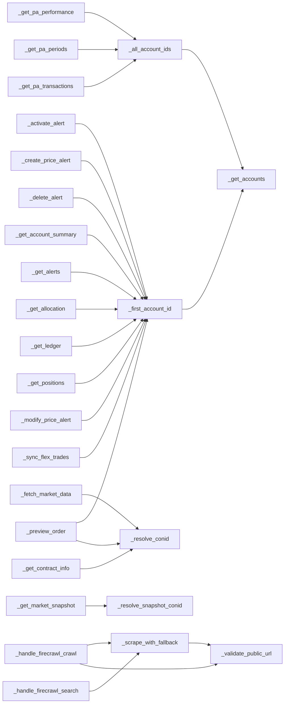

# claude_tools.py Audit — 2026-07

**Status:** IN PROGRESS — sections below are filled as workstreams complete.
**Spec:** docs/2026-07-02-claude-tools-audit-design.md
**Model used for all token counts:** claude-opus-4-8 (ClaudIA default)

## Decision summary

| # | Decision | Outcome | Evidence |
|---|---|---|---|
| D1 | Where ClaudIA slowness comes from | _pending — Task 12_ | Appendix B |
| D2 | Split go/no-go + architecture | _pending — Task 12_ | Appendices C, D, E |
| D3 | Tool-exposure strategy | _pending — Task 12_ | Appendices A, B, E |
| D4 | Sequencing vs. scraping-RAG layer 2 | _pending — Task 12_ | Appendices A, E |
| D5 | Documentation verdicts | _pending — Task 12_ | Appendix G |

## Appendix A — Token weight (WS1a)

**Method:** leave-one-out marginal cost via `client.messages.count_tokens` (exact API counts, not estimates). `full − without_i` isolates each tool's true marginal cost, immune to the fixed tool-use system-prompt overhead the API adds. Baseline (no tools) isolates that overhead separately. Script: `scripts/audit/count_tool_tokens.py`. Raw data: `docs/superpowers/audit-evidence/token_counts.json` (gitignored, local-only — evidence reproduced here in full since the report must be self-contained).

Measured 2026-07-02; the claudia local tools (`_LOCAL_TOOLS`) and system prompt files were read from claudia_ui commit `57978c6`. The system prompt figure measures the committed `docs/context.md` + `docs/principles.md` baseline; Drive overrides at runtime may differ slightly.

**Note on tool count:** the task brief expected 42 toolkit + 3 local = 45 tools. The actual measured count is **42 toolkit + 4 local = 46** — `claudia/agent.py`'s `_LOCAL_TOOLS` currently has 4 entries (`list_doc_versions`, `get_doc_version`, `search_past_conversations`, `fetch_web_page`), one more than expected. This is a real discrepancy in the codebase vs. the brief's assumption, not a script defect — verified by direct AST extraction of both `TOOL_DEFINITIONS` and `_LOCAL_TOOLS`. All 46 entries are accounted for below.

### Totals

| Metric | Value |
|---|---|
| Model | `claude-opus-4-8` |
| Tool count | 46 (42 `ClaudeToolkit` + 4 `claudia` local) |
| Baseline (no tools, no system) | 8 tokens |
| Full payload (baseline + all 46 tool schemas) | 9,481 tokens |
| **Tool surface total** (full − baseline) | **9,473 tokens** |
| **System prompt tokens** (context.md + principles.md) | **11,113 tokens** |
| **Static prefix per call** (tool surface + system prompt) | **20,586 tokens** |

**Sanity checks:**
- Every marginal cost is positive: **PASS** (46/46 entries > 0, verified programmatically).
- `tool_surface_total` within ~2% of the sum of all marginals: sum of marginals = 9,183; tool_surface_total = 9,473; diff = 3.06%. **Slightly over the ~2% guideline** — attributed to tokenizer boundary effects at JSON-array join points (removing one tool changes commas/whitespace context for its neighbors), which is expected for leave-one-out on a comma-joined array rather than a sign of a measurement error. Not treated as a blocking anomaly.
- `static_prefix_total` (20,586 tokens) is in the plausible thousands-to-tens-of-thousands range: **PASS**.

### Full ranked per-tool table (all 46 tools)

| Rank | Tool | Marginal tokens | % of tool surface |
|---|---|---|---|
| 1 | `get_market_snapshot` | 911 | 9.62% |
| 2 | `create_price_alert` | 501 | 5.29% |
| 3 | `run_backtest` | 344 | 3.63% |
| 4 | `modify_price_alert` | 328 | 3.46% |
| 5 | `run_scanner` | 324 | 3.42% |
| 6 | `preview_order` | 301 | 3.18% |
| 7 | `firecrawl_crawl` | 298 | 3.15% |
| 8 | `get_trades` | 296 | 3.12% |
| 9 | `fetch_market_data` | 263 | 2.78% |
| 10 | `add_indicators` | 258 | 2.72% |
| 11 | `get_trading_schedule` | 255 | 2.69% |
| 12 | `get_live_orders` | 254 | 2.68% |
| 13 | `generate_pinescript` | 251 | 2.65% |
| 14 | `firecrawl_search` | 249 | 2.63% |
| 15 | `get_analytics` | 243 | 2.57% |
| 16 | `delete_cache` | 230 | 2.43% |
| 17 | `import_flex_file` | 209 | 2.21% |
| 18 | `fetch_web_page` | 208 | 2.20% |
| 19 | `sync_flex_trades` | 204 | 2.15% |
| 20 | `search_contract` | 199 | 2.10% |
| 21 | `verify_flex_import` | 188 | 1.98% |
| 22 | `check_cache` | 186 | 1.96% |
| 23 | `search_past_conversations` | 164 | 1.73% |
| 24 | `get_futures` | 160 | 1.69% |
| 25 | `get_pa_performance` | 157 | 1.66% |
| 26 | `sync_flex_archive` | 156 | 1.65% |
| 27 | `get_pa_transactions` | 155 | 1.64% |
| 28 | `check_flex_coverage` | 148 | 1.56% |
| 29 | `diagnose_orders` | 145 | 1.53% |
| 30 | `get_contract_info` | 145 | 1.53% |
| 31 | `activate_alert` | 145 | 1.53% |
| 32 | `get_doc_version` | 138 | 1.46% |
| 33 | `get_option_chain` | 117 | 1.24% |
| 34 | `delete_alert` | 117 | 1.24% |
| 35 | `get_order_status` | 96 | 1.01% |
| 36 | `get_pnl` | 95 | 1.00% |
| 37 | `get_pa_periods` | 94 | 0.99% |
| 38 | `get_notifications` | 91 | 0.96% |
| 39 | `list_doc_versions` | 82 | 0.87% |
| 40 | `get_account_summary` | 78 | 0.82% |
| 41 | `get_allocation` | 73 | 0.77% |
| 42 | `get_ledger` | 71 | 0.75% |
| 43 | `get_alerts` | 65 | 0.69% |
| 44 | `get_watchlists` | 65 | 0.69% |
| 45 | `list_cache` | 64 | 0.68% |
| 46 | `get_positions` | 62 | 0.65% |

### TradingView tools (unmeasured)

TradingView Desktop / the bridge was checked via `claudia.tradingview.TradingViewBridge().get_tools()` and returned an empty list (`[]`) — TradingView Desktop is not currently running/connected on this machine. Per the measurement protocol, no placeholder or estimated numbers were recorded. `tradingview-mcp` advertises **78 tools**; when the bridge is connected, these ride the *same* payload as every other tool (added to `all_tools` in the script) and would materially increase the static prefix per call — this is unmeasured and should be treated as a known gap in the token-weight picture, not zero cost.

**Rerun instruction (once TradingView Desktop is running and connected):**
```bash
cd /Users/steph/Claude_Projects/claudia_ui && .venv/bin/python -c "
import json
from claudia.tradingview import TradingViewBridge
print(json.dumps(TradingViewBridge().get_tools()))
" > /Users/steph/Claude_Projects/ibkr_core_mcp/docs/superpowers/audit-evidence/tv_tools.json
cd /Users/steph/Claude_Projects/ibkr_core_mcp && .venv/bin/python scripts/audit/count_tool_tokens.py \
    --out docs/superpowers/audit-evidence/token_counts_with_tv.json \
    --extra-tools docs/superpowers/audit-evidence/tv_tools.json
```

### Layer-2 projection (D4 input)

Projected cost of adding the 3 planned "layer-2 web-docs" tools (`list_web_docs`, `read_web_doc`, `delete_web_docs`) from the approved scraping-RAG design, measured the same way as the baseline above (leave-one-out marginal cost, `claude-opus-4-8`, 2026-07-02). Fixture: `docs/superpowers/audit-evidence/layer2_tools.json`. Result: `docs/superpowers/audit-evidence/token_counts_with_layer2.json` (49 tools total: 46 baseline + 3 new).

| Tool | Marginal tokens |
|---|---|
| `list_web_docs` | 203 |
| `read_web_doc` | 135 |
| `delete_web_docs` | 205 |
| **Total delta** | **543** |

- Delta = new `tool_surface_total` (10,016) − baseline `tool_surface_total` (9,473) = **543 tokens**.
- As % of current tool surface (9,473 tokens): **5.73%**.
- As % of current static prefix per call (20,586 tokens): **2.64%**.
- Sanity check: sum of the three per-tool marginals (203 + 135 + 205 = 543) equals the total delta exactly — **PASS**.

These three schemas are projections transcribed from the scraping-RAG spec (`claudia_ui` `docs/superpowers/specs/2026-07-01-scraping-rag-pipeline-design.md`) for measurement purposes only, measured 2026-07-02 with the same model; final schemas will be decided when layer 2 is built.

## Appendix B — Latency decomposition (WS1b)
_pending — Tasks 4–6_

## Appendix C — Code findings table (WS2a)
_pending — Task 8_

## Appendix D — Cross-domain dependency graph (WS2b)

**Method:** AST extraction of every `self.<name>(...)` call inside each `ClaudeToolkit` method body, restricted to targets that are themselves `ClaudeToolkit` methods (self-recursion excluded). Script: `scripts/audit/dep_graph.py`. Raw adjacency map: `docs/superpowers/audit-evidence/dep_graph.json` (gitignored, local-only — reproduced here in full since the report must be self-contained). Measured 2026-07-02 against `ibkr_core_mcp/claude_tools.py` at commit `4267195`.

Verification: script output was independently cross-checked against a manual read of all 42 handler bodies plus every private helper (`_get_accounts`, `_first_account_id`, `_all_account_ids`, `_resolve_conid`, `_resolve_snapshot_conid`, `_validate_public_url`, `_scrape_with_fallback`) — the manual tally matches the script's 24 edges exactly, with the same 22 source methods and same targets.

**Dispatch pattern:** `execute()` builds `handlers = {"fetch_market_data": self._fetch_market_data, ...}` (bound-method *references*, no parentheses) and calls the resolved variable (`handler(inputs)`), not `self.<name>(...)` directly. Per the AST matching rule this produces **zero edges out of `execute()`** — confirmed in the graph below (no `execute -->` lines). This is the "dict of method references" case anticipated in the task brief: dispatch is O(1) and structurally decoupled from the handler bodies, so `execute()` itself is not a graph hazard for the split.

**Note on `_safe_error`:** the task brief and the architecture note both cite `_safe_error` as a canonical shared helper. On inspection, `_safe_error` (and `_validate_account_id`, `_parse_live_trades`, `_format_coverage`, `_TODAY`) are **module-level functions defined outside the `ClaudeToolkit` class** (e.g. `_safe_error` at line 740, class starts at line 839), called as bare names (`_safe_error(name, e)` in `execute()`), never as `self._safe_error(...)`. They are therefore invisible to this graph by construction — not a script defect, just a scope fact worth carrying into the WS2c/2d structural assessment: these free functions migrate to `tools/_base.py` independent of the class-method call graph analyzed here.

### Graph (mermaid, exact output of `dep_graph.py`)



**No cycles.** Every path terminates in at most 2 hops (handler → helper/utility; utilities never call back into a handler), so the graph is a DAG by inspection — `_get_accounts`, `_resolve_conid`, `_resolve_snapshot_conid`, and `_validate_public_url` make zero outbound `self.*` calls of their own.

### Module assignment (all 42 handlers)

| Module | Handlers |
|---|---|
| **market_data** | `fetch_market_data`, `check_cache`, `list_cache`, `delete_cache`, `get_futures`, `get_market_snapshot`, `get_trading_schedule`† |
| **portfolio** | `get_account_summary`, `get_positions`, `get_ledger`, `get_allocation`, `get_pa_periods`, `get_pa_performance`, `get_pa_transactions`, `get_notifications`†, `get_pnl`† |
| **orders** | `get_live_orders`, `diagnose_orders`†, `preview_order`, `get_alerts`, `create_price_alert`, `modify_price_alert`, `delete_alert`, `activate_alert`, `get_order_status`† |
| **trades** | `get_trades`, `sync_flex_archive`, `import_flex_file`, `check_flex_coverage`, `verify_flex_import`, `sync_flex_trades` |
| **instruments** | `get_contract_info`, `get_option_chain`, `run_scanner`, `search_contract`, `get_watchlists`† |
| **analytics** | `add_indicators`, `run_backtest`, `generate_pinescript`, `get_analytics`† |
| **web** | `firecrawl_search`, `firecrawl_crawl` |

† = not explicitly placed by the 2026-06-27 architecture note; judgment call, rationale below.

| Handler | Assigned to | Rationale |
|---|---|---|
| `get_trading_schedule` | market_data | Session hours for a symbol — same "quote a symbol" shape as `get_market_snapshot`/`get_futures`, no order or account state involved. |
| `get_notifications` | portfolio | FYI notifications/unread count are account-level status, same category as `get_account_summary`/`get_ledger`, not an order or a price-threshold alert. |
| `get_watchlists` | instruments | Returns symbol lists (IBKR-side watchlists), closer to the contract/symbol bucket than to account or order state. |
| `get_pnl` | portfolio | Real-time P&L by position is account performance state, grouped with `get_account_summary`/`get_ledger`/PA. |
| `diagnose_orders` | orders | Explicitly a debugging companion to `get_live_orders` — same endpoint family, same module. |
| `get_order_status` | orders | Single-order status lookup, same domain as `get_live_orders`/`preview_order`. |
| `get_analytics` | analytics | Sharpe/Sortino/Calmar/CAGR from cached bars — same bucket as `add_indicators`/`run_backtest` (the note's "analytics" module is literally named for this). |

### Helper classification

| Method | Classification | Why |
|---|---|---|
| `_get_accounts` | **Shared helper** | Pure account-list plumbing (`client.get_accounts()` + empty-check); no business logic, called only by the two other account helpers. |
| `_first_account_id` | **Shared helper** | Named explicitly in the architecture note as a `_base.py` candidate; called by handlers in portfolio, orders, and trades. |
| `_all_account_ids` | **Shared helper** | Same as above, for PA's multi-account calls. |
| `_resolve_conid` | **Domain logic (instruments)**, not a helper | Wraps `client.search_contract` / `client.get_futures` — this *is* the instrument-resolution business logic the note assigns to `instruments.py` ("contracts/options/scanner"). Calling it a helper would hide the real coupling between market_data/orders and instruments. |
| `_resolve_snapshot_conid` | **Domain logic (instruments)**, not a helper | Same reasoning as `_resolve_conid` — sec_type-dispatched conid resolution (STK/IND/BOND via secdef search, FUT via `/trsrv/futures`, CASH via currency pairs) is instrument-domain logic, not generic plumbing. |
| `_validate_public_url` | **Domain-internal (web)**, not a shared helper | SSRF guard is only ever called from web-domain code (`_scrape_with_fallback`, `_handle_firecrawl_crawl`); the architecture note itself assigns it to `web.py` ("firecrawl, SSRF guard"). No handler outside web touches it. |
| `_scrape_with_fallback` | **Domain-internal (web)**, not a shared helper | Firecrawl→Crawl4AI fallback orchestration, called only by the two firecrawl handlers. |
| `_safe_error` and other module-level functions | **N/A — not class methods** | See note above; excluded from the graph by construction, not classified as helper or domain logic here. |

### Edge accounting

24 total edges. Split three ways:

- **3 cross-domain edges** (real handler→handler coupling across the proposed module boundary, excluding anything that lands on a shared helper):
  - `_fetch_market_data` (market_data) → `_resolve_conid` (instruments)
  - `_get_market_snapshot` (market_data) → `_resolve_snapshot_conid` (instruments)
  - `_preview_order` (orders) → `_resolve_conid` (instruments)
- **16 helper edges** (edges whose target is `_get_accounts`, `_first_account_id`, or `_all_account_ids`):
  `_first_account_id`→`_get_accounts`, `_all_account_ids`→`_get_accounts` (2); →`_first_account_id` from `_get_account_summary`, `_get_positions`, `_sync_flex_trades`, `_get_ledger`, `_get_allocation`, `_preview_order`, `_get_alerts`, `_create_price_alert`, `_modify_price_alert`, `_delete_alert`, `_activate_alert` (11); →`_all_account_ids` from `_get_pa_periods`, `_get_pa_performance`, `_get_pa_transactions` (3).
- **5 intra-domain edges** (source and target both resolve to the same proposed module — not counted as cross-domain, not a helper edge):
  `_get_contract_info`→`_resolve_conid` (instruments→instruments); `_scrape_with_fallback`→`_validate_public_url`, `_handle_firecrawl_search`→`_scrape_with_fallback`, `_handle_firecrawl_crawl`→`_scrape_with_fallback`, `_handle_firecrawl_crawl`→`_validate_public_url` (all web→web).

3 + 16 + 5 = 24, matching the mermaid graph and `dep_graph.json` edge count exactly. A reader can recount this from the graph plus the module-assignment table alone: filter the 24 edges to targets in {`_get_accounts`,`_first_account_id`,`_all_account_ids`} → 16 helper edges; of the remaining 8, the 3 whose source-module ≠ target-module are the cross-domain edges above, and the other 5 have source-module = target-module.

### Interpretation

The graph is cleanly cuttable under the D2 criterion: it is a DAG (no cycles, max depth 2), 16 of 24 edges (67%) resolve to the three account-lookup helpers the architecture note already scoped for `tools/_base.py`, and the remaining 8 split into 5 same-module edges (no split cost) and only 3 true cross-domain edges — all three converge on the same coupling: market_data (`_fetch_market_data`, `_get_market_snapshot`) and orders (`_preview_order`) both need instruments' conid-resolution logic (`_resolve_conid`/`_resolve_snapshot_conid`). This is a single, well-defined dependency (two consumer domains → one producer domain, not a tangle), and it is exactly the shape Option A (composition — `MarketDataHandlers`/`OrdersHandlers` each take an `InstrumentsHandlers` reference at construction) was designed to handle. No handler in the proposed `analytics`, `trades`, or `web` modules makes any cross-domain call at all. Net: the 2026-06-27 architecture note's Option A recommendation is directly actionable with this graph as evidence — the split precondition it asked for is satisfied.

## Appendix E — Structural assessment (WS2c/2d)
_pending — Task 9_

## Appendix F — Tool → authoritative-source map (WS3a)
_pending — Task 10_

## Appendix G — Docs verdict table (WS3b/3c)
_pending — Task 11_
