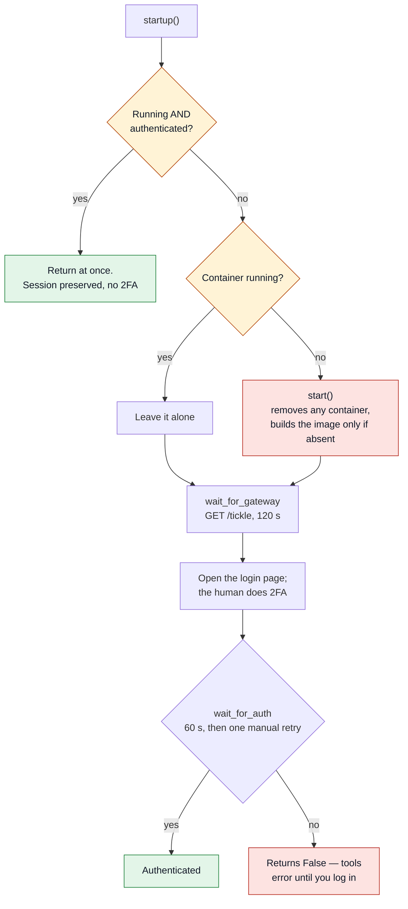
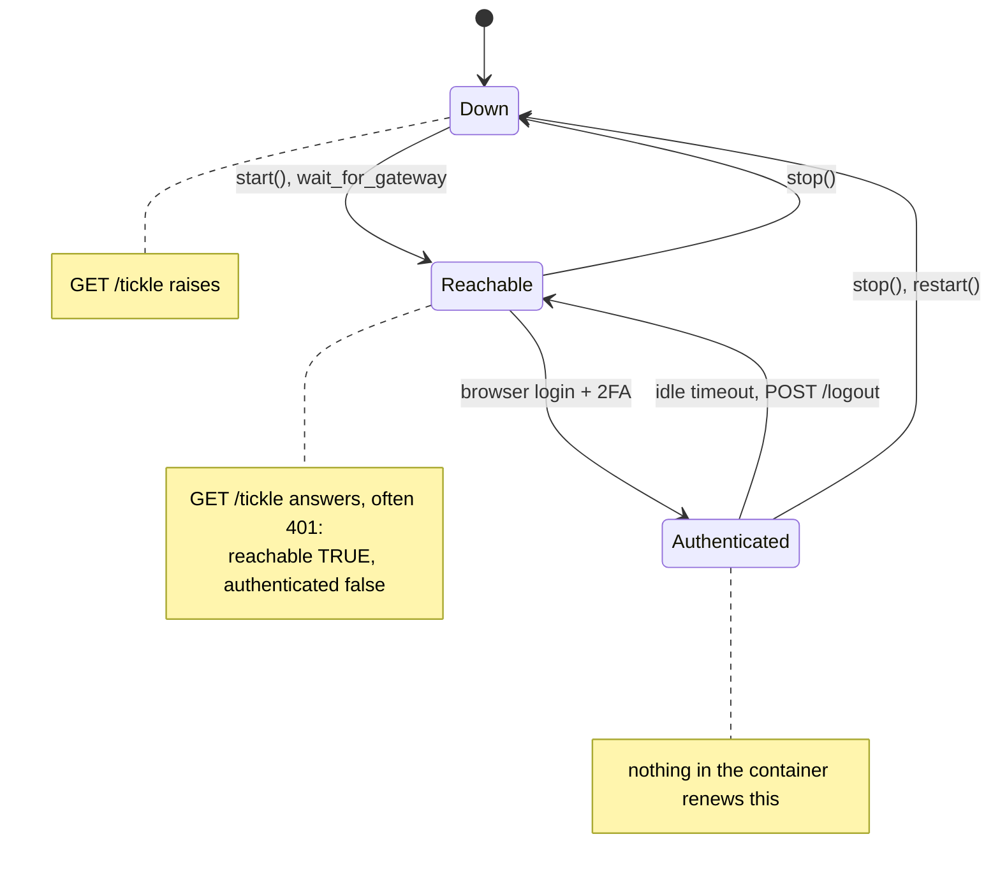
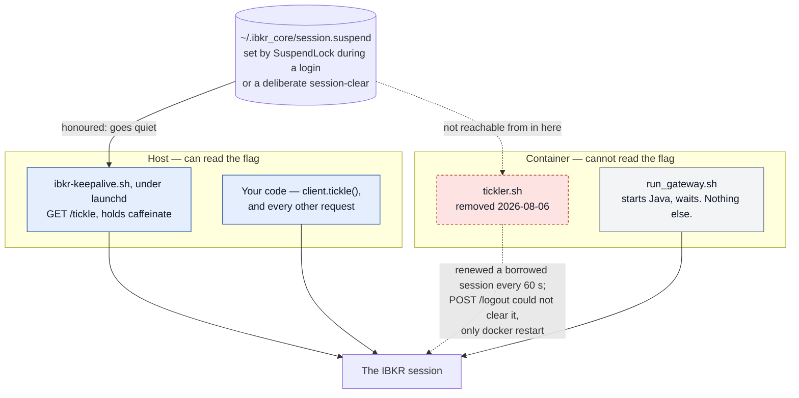

# Gateway Authentication & Session — Full Reference

The IBKR Client Portal Gateway must run on the **same machine** as the browser used to authenticate. No cloud deployment possible.

Three things here have each cost a real debugging session, and each is drawn below because it
is shape, not prose: what `startup()` will and will not destroy, where a session can be, and
which side of the container boundary may renew it.

---

## First login

`BrowserCookieAuth` (default) reads Chrome's cookie store for `localhost`. On first use:

1. Start the gateway using the built-in `GatewayManager` (see below)
2. Open `https://localhost:5055` in Chrome
3. Log in with IBKR credentials + 2FA (challenge code shown in-browser → IBKR Mobile → enter the response code)
4. Wait for "Client login succeeds" in browser
5. The package reads the session cookie automatically

**Starting the gateway:**
```python
from ibkr_core_mcp import GatewayManager

gm = GatewayManager()
gm.startup()   # builds Docker image on first run, then opens browser for login
```

Or from a script:
```bash
python -c "from ibkr_core_mcp import GatewayManager; GatewayManager().startup()"
```

The gateway Docker image (`ibkr-core-gateway`) is built from assets bundled
inside `ibkr_core_mcp/gateway/`. No external repo is required.

For headless use (ML batch jobs), pass a pre-extracted cookie string:
```python
from ibkr_core_mcp import IBKRClient, TokenAuth, Config

client = IBKRClient(Config.from_env(), auth=TokenAuth("cookie_string_here"))
```

---

## What `startup()` will and will not destroy



The two diamonds are the whole point. `start()` removes any existing container, and the session
lives in that container's Java process — so calling it throws the session away and forces a
fresh 2FA. Until 2026-08-06 it ran on **every** launch where the gateway was not already
authenticated, discarding sessions a pre-flight would have found perfectly usable. A container
that is absent or stopped cannot hold a session, so recreating one is free; a *running* one is
left alone.

**A rebuild is not automatic.** `start()` builds the image only when it is absent, so after
changing anything that ships into it (`Dockerfile`, `conf.yaml`, `run_gateway.sh`,
`healthcheck.sh`) you must `docker rmi ibkr-core-gateway` first — a restart alone keeps running
the old image. That is exactly how the in-container tickler survived its own removal for a day.

---

## Where a session can be



**Reachable is not authenticated, and 401 is good news.** `is_gateway_reachable` counts any
status from 200 to 599 as up: a 401 means the Java process is answering and holds no session,
which is the best possible moment to log in. Treating it as "down" told a user to start a
gateway that was running perfectly (measured 2026-08-05).

**An idle timeout lands you in `Reachable`, not `Down`.** The container is still up and the
port still answers; only the session is gone. That is a browser login away, not a restart.

Both probes are **GET**, not POST, since 2026-08-06: `/tickle` is documented as "pings the
server to prevent the session from ending", so a POST is a session-affecting write dressed as a
health check — and `wait_for_gateway` calls it in a loop. Merely asking "is it up?" renewed the
keepalive timer, which is the exact traffic the suspend flag below exists to stop.

---

## Keeping the session alive



**The session expires without activity, and nothing in the container renews it — you must run
your own keepalive.** This page said the opposite until 2026-08-07: that a bundled `tickler.sh`
POSTed `/tickle` every 60 s so callers did not need one. That was the reassuring half of the
claim, and a caller who believed it ran no keepalive and watched sessions expire with nothing to
explain why. The in-container tickler was removed on 2026-08-06 and the script deleted on
2026-08-07; the same false claim was corrected in `gateway/__init__.py` on 2026-08-06 and this
page was missed.

Renewal cannot live in the container, and the diagram is the reason: the flag that coordinates a
login or a deliberate session-clear is `~/.ibkr_core/session.suspend`, written host-side by
`claudia/gateway_session.py :: SuspendLock`, and nothing inside the container can read it. IBKR
renews a session on **any** request, not just `/tickle`, so one un-silenceable renewer defeats
every attempt to clear a session — on 2026-08-05 three such ticklers renewed a **borrowed**
session every 60 s, and `POST /logout` could not clear it, only `docker restart` could.

Call `client.tickle()` from the host, and pause it while a login is in flight. claudia_ui does
this with `scripts/ibkr-keepalive.sh` under launchd (`RunAtLoad` + `KeepAlive`, installed by
`scripts/install-ibkr-keepalive-daemon.sh`); it honours the suspend flag and holds the
`caffeinate` assertion that stops the Mac sleeping the session away. **If that daemon is not
installed, nothing renews an idle session.**

---

## Rate limits

IBKR's documented global limit is **10 requests/second** for any endpoint not in its
per-endpoint table (several are far stricter — `/iserver/account/orders` and
`/iserver/account/trades` are 1 req/5s, `/pa/*` and `/iserver/scanner/params` are 1 req/15
mins, `/tickle` is 1 req/s). Exceeding a limit returns HTTP 429 and puts the **IP** in a
fifteen-minute penalty box that applies to every endpoint, not only the one that broke the
limit. Repeat violators can be blocked permanently.

`rate_limiter.py` now does two things:

- **`EndpointPacer` paces proactively**, before the request goes out, against a sliding
  window per endpoint. The limits live in `rate_limiter.ENDPOINT_LIMITS` — one executable
  table, deliberately with no second table in prose, because the prose copy is what went
  stale (see below). The per-tool one-line rate-limit notes in `docs/tools-reference.md` and
  `docs/api-reference.md` restate single rows and are the copies to check when the table
  changes: the history endpoint's still read "5 concurrent requests" in both files and in
  `client.py`'s docstring until 2026-09-17, a day after the table itself was corrected.
  Ordinary spaced-out usage never waits.
- **`with_retry` reacts**, retrying 429/503 with exponential backoff (1s, 2s, 4s over 3
  attempts) and raising `IBKRRateLimitError` if still failing. Each retry goes back through
  the pacer before it is sent — a retry is a request too; until 2026-09-17 only the first
  attempt was paced and the window never saw the others (API-R8).
- **One budget per path.** The table is keyed by (path, method) as IBKR's is; a path
  listed under two verbs pools every verb's limits into one bucket, the stricter window
  binding. Deliberate: separate buckets would be right if IBKR counts the verbs separately
  and would earn the penalty box if it does not, while pooling costs at most one needless
  wait (API-R11).

Until 2026-09-16 only the second existed, while this file and two others described the
first. It was not academic: `get_market_history_paginated` was measured issuing chunk
requests at **284/minute** against a published ceiling of 50, and its 120-chunk guard would
have completed in ~25 seconds — 2.4x a minute's allowance inside half a minute — against a
reactive retry budget of seven seconds.

**The pacer's budget is per process; IBKR's limit is per IP.** Nothing is shared between
interpreters, so several processes can each stay inside the limit while together breaking
it. Demonstrated on 2026-09-16: a run of short-lived probe scripts against the live gateway,
each starting with an empty budget, earned HTTP 429 and the fifteen-minute penalty box
although no single process exceeded 50 requests in a minute. This is how the package is
normally used — a pytest run, a script and an MCP server are three processes on one IP — so
treat it as a real gap, not a corner case. Closing it needs cross-process state and has not
been done. Practical rule: **do not run live suites concurrently, and treat back-to-back
script invocations as sharing one budget.**

**The pacer never blocks longer than `_MAX_PACING_WAIT` (65 s).** The 1-req/15-mins
endpoints are why: blocking a tool call for 900 s would be worse than the 429 being
avoided, and failing the call outright would break a request that succeeds today. Past the
cap it emits a `UserWarning` naming the endpoint and how early the call is, and sends it.

**The per-endpoint table moved into code because the prose copy went stale.** IBKR changed
`/iserver/marketdata/history` from "5 concurrent requests" to "10 req/sec or 50 req/min" at
the 2026-08 documentation move; the link-repointing pass updated the citation URL without
re-reading the page behind it, so the wrong value survived with a correct-looking source
beside it. Re-read and diffed row by row 2026-09-16: 25 of 26 rows agreed, that one did not.
Source: https://www.interactivebrokers.com/docs/web-api/v1/pacing-limitations
