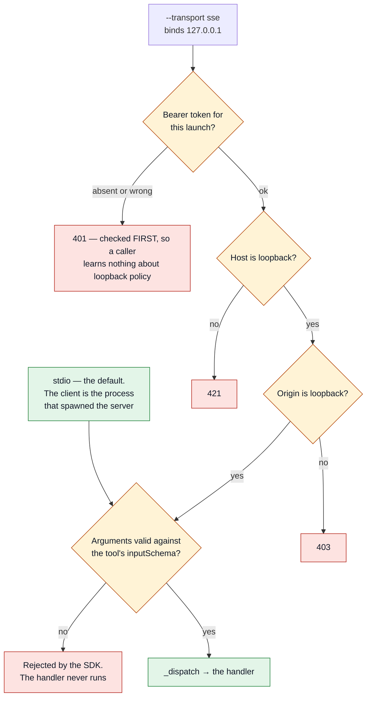

# MCP Server — Full Reference

`ibkr_core_mcp` ships a built-in MCP server exposing 46 tools and 4 resources.
Any MCP-compatible client — Claude Desktop, a custom chatbot, a dashboard, or an
ML pipeline — connects without requiring the `anthropic` SDK.

## Install

```bash
pip install "ibkr_core_mcp[server]"
```

## stdio — Claude Desktop

```bash
python -m ibkr_core_mcp.mcp_server
```

Claude Desktop config (`~/Library/Application Support/Claude/claude_desktop_config.json`):
```json
{
  "mcpServers": {
    "ibkr": {
      "command": "/path/to/.venv/bin/python",
      "args": ["-m", "ibkr_core_mcp.mcp_server"],
      "env": {
        "IBKR_GATEWAY_URL": "https://localhost:5055/v1/api",
        "ANTHROPIC_API_KEY": "sk-ant-...",
        "GOOGLE_DRIVE_FOLDER_ID": "...",
        "IBKR_SQLITE_PATH": "~/.ibkr_core/store.db",
        "GDRIVE_TOKEN_FILE": "~/.ibkr_core/token_ibkr_core_mcp.json",
        "GDRIVE_CREDENTIALS_FILE": "~/.ibkr_core/credentials_ibkr_core_mcp.json"
      }
    }
  }
}
```

## HTTP/SSE — dashboard and chatbots

```bash
# No live push (ibkr://pnl/live resource stays empty; all 46 tools remain fully callable)
python -m ibkr_core_mcp.mcp_server --transport sse --port 5174

# With WebSocket live quotes and price alerts
python -m ibkr_core_mcp.mcp_server --transport sse --port 5174 --stream
```

The server binds to `127.0.0.1` only — never exposed to external networks.
Connect MCP clients to `http://localhost:5174/sse`.

## Tools (46)

All 44 `ClaudeToolkit` tools plus:
- `add_price_alert` — register a threshold alert (persisted to SQLite)
- `get_price_alerts` — list active or all alerts

## Resources

| URI | Content |
|---|---|
| `ibkr://accounts` | All IBKR accounts |
| `ibkr://positions/current` | Current positions for primary account |
| `ibkr://trades/recent` | Last 100 trades from SQLite |
| `ibkr://pnl/live` | Latest account P&L snapshot (WebSocket `spl` topic, `--stream` only) |

## Price alerts (programmatic)

```python
import asyncio
from ibkr_core_mcp import Config, IBKRWebSocket, AlertManager, SQLiteStore
from ibkr_core_mcp.auth import BrowserCookieAuth
import requests

async def main():
    cfg = Config.from_env()
    store = SQLiteStore(cfg)

    session = requests.Session()
    BrowserCookieAuth().apply(session)
    cookie = session.headers.get("Cookie", "")

    ws = IBKRWebSocket(cfg.gateway_url, cookie)
    await ws.connect()
    await ws.subscribe(265598)  # AAPL conid

    store.add_alert(265598, "AAPL", 185.0, "above")
    manager = AlertManager(store)

    async for quote in ws.listen():
        for alert in manager.check_quote(quote):
            print(f"ALERT: {alert['symbol']} hit {alert['threshold']}")

asyncio.run(main())
```

## TradingView integration

`tradingview-mcp` (MIT, Node.js) connects to TradingView Desktop via Chrome
DevTools Protocol and exposes 78 tools: chart reading, PineScript injection,
drawings, and replay. Run it alongside ibkr-core-mcp so Claude can read live
charts and query your IBKR account in the same conversation:

```json
{
  "mcpServers": {
    "ibkr":        { "command": "python", "args": ["-m", "ibkr_core_mcp.mcp_server"], "env": { "..." : "..." } },
    "tradingview": { "command": "npx",    "args": ["-y", "tradingview-mcp"] }
  }
}
```

See: https://github.com/tradesdontlie/tradingview-mcp


---

## SSE transport security (2026-09-13)

`--transport sse` binds `127.0.0.1` and, since 2026-09-13, validates `Host` and `Origin` through
the MCP SDK's `TransportSecuritySettings` (loopback on any port). Without those settings the SDK
disables its DNS-rebinding protection, which would let a web page in the operator's browser
drive every tool once its DNS answer flipped to 127.0.0.1. A foreign `Host` receives 421, a
foreign `Origin` 403, and loopback passes with or without a port; `tests/security/test_transport_security.py`
exercises all three. Detail: `SECURITY.md` § MCP Transports.

## SSE bearer token (2026-09-14)

Host/Origin validation keeps out the browser and the LAN, not another process on the machine —
which needs no DNS trick, just the port. Every SSE request must therefore present this launch's
bearer token:

```bash
python -m ibkr_core_mcp.mcp_server --transport sse --port 5174
# ibkr-core-mcp: SSE bearer token for this launch written to
#   /Users/<you>/.ibkr_core/mcp_sse_token — clients must send 'Authorization: Bearer <token>'.
```

The token is a fresh `secrets.token_urlsafe(32)` per launch, written 0600 and never printed.
A client reads the file and sends the header:

```python
from mcp.client.sse import sse_client

token = (Path.home() / ".ibkr_core" / "mcp_sse_token").read_text().strip()
async with sse_client("http://localhost:5174/sse", headers={"Authorization": f"Bearer {token}"}) as (r, w):
    ...
```

Anything else gets 401 on both `/sse` and `/messages/`, checked before Host and Origin so an
unauthenticated caller learns nothing about the loopback policy. SSE is still the lower-trust
transport — prefer stdio, where the client is the process that spawned the server, and start SSE
only for a local consumer that needs it. Reasoning and sources: `SECURITY.md` § MCP Transports;
applicability decision: `docs/audits/owasp-mcp-guide-applicability-2026-09-14.md` § Phase 3 A.

## What a call passes through before it reaches a handler



The order is deliberate: the token is checked **before** `Host` and `Origin`, so an
unauthenticated caller cannot learn the loopback policy from the response it gets. stdio skips
all three because the client is the process that spawned the server — which is why it stays the
preferred transport, and SSE is started only for a local consumer that needs it.

## Tool annotations (2026-09-13)

`tools/list` carries MCP `ToolAnnotations` for every tool, derived from its declared
`capabilities`: `readOnlyHint` when the tool touches nothing but reads and in-process compute,
`destructiveHint` when it writes or deletes on Drive or mutates IBKR account state,
`openWorldHint` when it reaches a remote service or the web. Clients that gate confirmation
prompts on those hints (Claude Desktop and others) therefore see the same classification the
test suite enforces.
