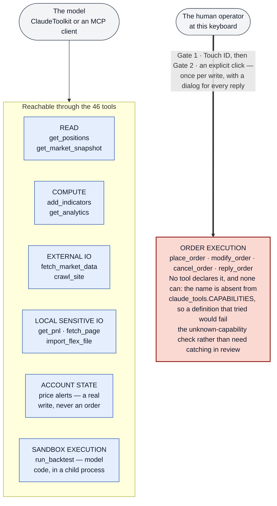
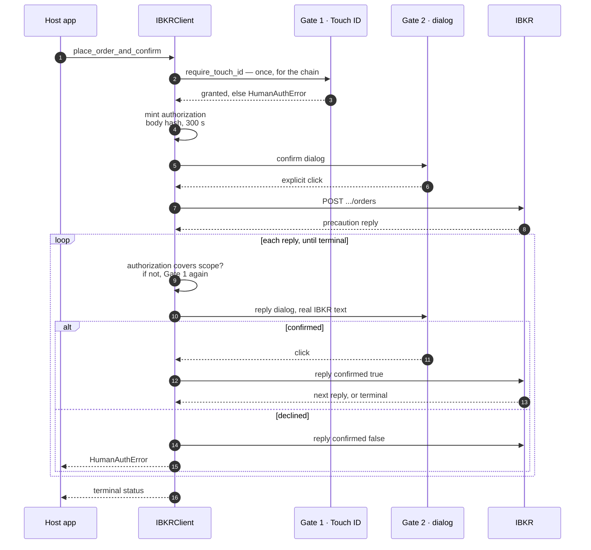
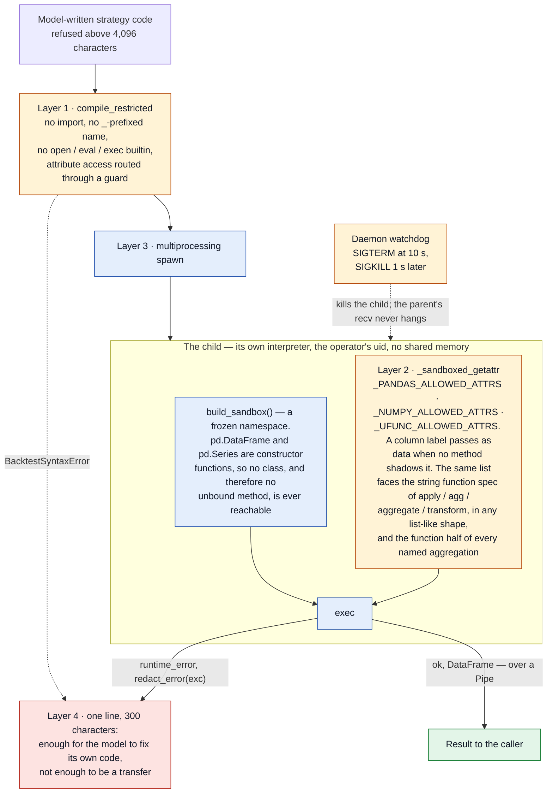
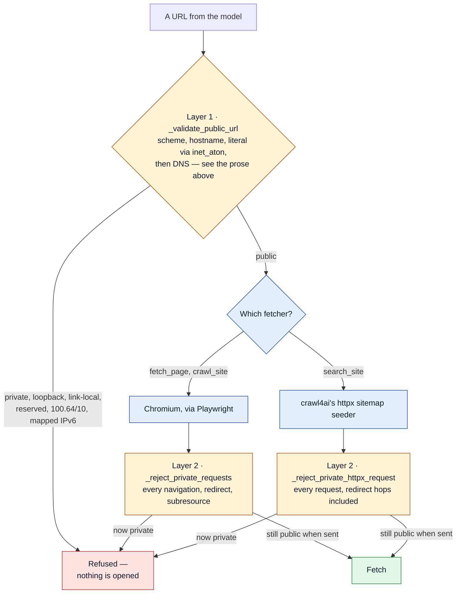
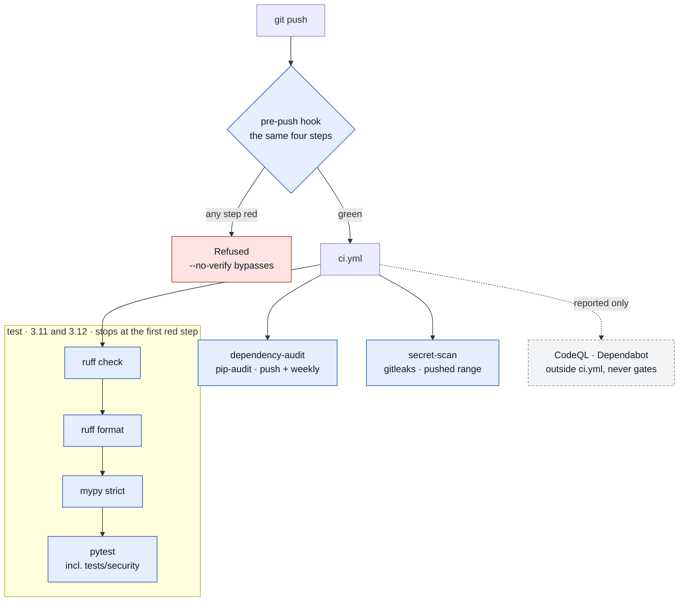

# Security Architecture

The living design document for how `ibkr_core_mcp` keeps a language model, a web page, and a
future coding agent away from a live brokerage account — and how that is *enforced* rather
than intended.

**How this differs from the other two security documents.**

| Document | Kind | Answers |
|---|---|---|
| `SECURITY.md` | Policy and control inventory (the GitHub-conventional file, public-facing) | "What controls exist, where, and how do I report a vulnerability?" |
| **`docs/security-architecture.md`** (this file) | Living design | "Where are the boundaries, what must stay true, what enforces it, why was it built this way, and how do I change it without breaking it?" |
| `docs/audits/security-architecture-audit-2026-09-13.md`, earlier audits, and `docs/audits/owasp-mcp-guide-applicability-2026-09-14.md` (the external-baseline mapping) | Point-in-time evidence, never retroactively edited | "What was found on that day, what was proven, what was done?" |

When a control changes, `SECURITY.md` and this file change together; the audit that motivated
the change stays as it was.

**The five diagrams.** §2 (what the model can reach), §6.1 (an order write, end to end), §6.3
(the sandbox), §6.4 (the two SSRF layers) and §7 (the gates a push passes). Each shows
something its section cannot say in prose — an unreachable tier, an ordering, a process
boundary, a branch, what blocks versus what merely reports — and each is a control drawing, not
decoration: when the control moves, the diagram moves with it in the same commit. Where a
diagram and the prose beside it disagree, the prose and the test it names are the authority.

The bar a diagram has to clear here is that a reader takes something from it *at a glance* that
the prose or table beside it did not already give them. §3's map was drawn as a sixth diagram
and then cut: at 33 nodes it was the table re-boxed, and mermaid scales a wide diagram down to
the page column, so its labels landed around 8px. The ASCII map it would have replaced is
denser, sharper and readable at any width. A diagram that has to be zoomed to be read has
already failed.

---

## 1. Principals and threat model

| Principal | Trusted for | Not trusted for | Where it enters |
|---|---|---|---|
| **Human operator** | Configuration, credentials, approving each order write at the keyboard | Unattended automation of order writes (by design: every write needs a fingerprint and a click) | `.env`, the CLI, the two gates |
| **The model** (Claude, through `ClaudeToolkit` or the MCP server) | Reads, analysis, strategy code, proposing orders | Executing orders, reading credentials, reaching the local network, running unconfined code | Tool `inputs` dicts, resource URIs |
| **Web content** returned by `fetch_page`, `crawl_site`, `search_site`, `firecrawl_search` | Nothing | Anything — it is the prompt-injection vector | Back into the model context |
| **Another local process** (SSE transport only) | Nothing — it must present this launch's bearer token to be heard at all (§ 6.6) | Anything: with the token it has the full tool surface, and still never an order write (inv. 1) or a credential (inv. 6) | `GET /sse`, `POST /messages/` on 127.0.0.1 |
| **IBKR gateway** (localhost) | Market and account data | Rendering: reply messages are shown on Gate 2 and are HTML-stripped first | `IBKRClient._get/_post`, `IBKRWebSocket` |
| **Flex Web Service, Firecrawl, Google** | Their own data | Redirecting us: Flex statement URLs are allowlisted by prefix | `flex_query.py`, `web_scraper.py`, `cache.py` |
| **In-process code** (the host app, a dependency) | Everything the process can do | — this package does not defend the process against itself | Direct calls |
| **A future coding agent** editing this repo | Producing lint-clean, typed, green changes | Preserving a boundary it never saw named | `git commit` |

The last row is the one the 2026-09-13 audit was about. The question it asked of every
boundary was: *could a perfectly linted, perfectly typed, fully tested change violate this
silently?* Where the answer was yes, the boundary now has a test that reads the source.

**The deployment this is drawn for.** One operator, one personal workstation, local processes
only. The MCP server runs as the operator's own user because two of its controls cannot run
anywhere else — Gate 1 is Touch ID on that machine, Gate 2 is a dialog on that screen — and a
third, the IBKR session, is read from that user's browser cookie store. stdio is the natural
trust path: the client is the process that spawned the server. `--transport sse` is optional,
binds loopback, and since 2026-09-14 authenticates its client (§ 6.6). There is no remote
endpoint, no second tenant, no delegated identity, no shared service account, and no tool
loaded at runtime — the tool set is the installed package version. Every boundary below is
drawn for that picture; the control-level statement of the same thing is `SECURITY.md`
§ Security Scope and Deployment Model, and the external baseline read through it is
`docs/audits/owasp-mcp-guide-applicability-2026-09-14.md`.

**Out of scope, on purpose.** OS-level compromise of the operator's machine; an attacker with
the operator's browser session and physical presence; in-process code that monkeypatches the
gates (documented in `human_auth.OrderWriteAuthorization`); the operator approving a bad order.

---

## 2. Privilege tiers

Every capability in the package sits in one of six tiers. The model may reach the first five
through tools; the sixth it cannot reach at all.

| Tier | Meaning | Examples |
|---|---|---|
| **READ** | Reads IBKR, Drive or SQLite; changes nothing | `get_positions`, `get_market_snapshot`, `check_cache` |
| **COMPUTE** | In-process computation on fetched data | `add_indicators`, `get_analytics`, `generate_pinescript` |
| **EXTERNAL IO** | Writes outside the process but not to the account: Drive, SQLite, a remote service, the local browser | `fetch_market_data`, `crawl_site`, `sync_flex_trades`, `firecrawl_search` |
| **LOCAL SENSITIVE IO** | Reads browser cookies, saved browser profiles, local files under an allowlisted root | `get_pnl` (cookie read for the WebSocket touch), `fetch_page` (profiles), `import_flex_file` |
| **ACCOUNT STATE** | Mutates IBKR server-side state that is *not* an order | `create_price_alert`, `delete_alert`, `activate_alert`, `modify_price_alert` |
| **ORDER EXECUTION** | Places, modifies, cancels or confirms an order | `IBKRClient.place_order` and its three siblings — **no tool** |

`SANDBOX_EXECUTION` (`run_backtest`) is EXTERNAL IO in effect — it runs model-written code in a
child process — and is treated as its own capability because its boundary is a different
mechanism (§ 6.3).

The machine form of this table is the `capabilities` frozenset on every tool definition
(`claude_tools.CAPABILITIES`; § 5, invariant 3).

**The shape that matters is what is not drawn: the model has no arrow into the red box.**
ORDER EXECUTION is not *guarded against* the model, it is **unreachable by** it — so there is no
edge to guard. (The left column holds six entries rather than five: the five reachable tiers plus
`SANDBOX_EXECUTION`, which the paragraph above carries as its own capability rather than as a
tier.)



---

## 3. Trust-boundary map

```
SOURCE                  VALIDATION / NORMALISATION            SERVICE                         PRIVILEGED SINK
──────                  ──────────────────────────            ───────                         ───────────────
model tool inputs ────► input allowlists (preview),           ClaudeToolkit handler ────────► IBKRClient reads          [READ]
                        identifier regexes (client.py),                                  ──► IBKRClient alert writes   [ACCOUNT STATE]
                        cache-key regexes (cache.py),                                    ──► GDriveCache / WebDocsStore [EXTERNAL IO]
                        path-under-root (import_flex_file),                              ──► SQLiteStore               [EXTERNAL IO]
                        compile_restricted + attribute        backtest.run_backtest ────────► spawn child, exec         [SANDBOX]
                          allowlist (run_backtest),
                        _validate_public_url (layer 1) ───►   local_browser.scrape/crawl ──► Chromium + route guard    [EXTERNAL IO]
                                                              search_site_detailed ────────► httpx seeder + request hook

MCP HTTP request ─────► TransportSecuritySettings ───────────► SseServerTransport ─────────► every tool above
                        (Host / Origin loopback only)

web page content ─────► assess_quality (honesty flag) ───────► back into the model context    (no sink; the model is the sink)

IBKR reply message ───► reply_message_text (HTML strip) ─────► Gate 2 dialog                  (rendered to the human)

host app (in-process) ► _validate_account_id/_order_id ──────► IBKRClient.place_order ───────► Gate 1 ─► Gate 2 ─► POST /orders  [ORDER EXECUTION]
                                                              IBKRClient.get_order_preview ──► POST /orders/whatif  [ORDER PREVIEW, ungated]

exceptions (any) ─────► _safe_error (type → sentence)  ──────► tool result
                        redact_error (detail, scrubbed) ─────► tool result / log
```

The full tool-by-tool classification (validation, service, sink, declared capabilities) is
Phase 1 of the 2026-09-13 audit; it is the reference when a tool's declaration is in doubt.

---

## 4. The privileged sinks and who may touch them

| Sink | Only through | Guarded by |
|---|---|---|
| `POST /iserver/account/{acct}/orders`, `POST …/order/{id}`, `DELETE …/order/{id}`, `POST /iserver/reply/{id}` | `place_order`, `modify_order`, `cancel_order`, `reply_order`, `_resolve_one_reply` | Gate 1 + Gate 2 inside each; AST test that no other function builds these paths, in any string idiom (see § 5, invariant 1) |
| `POST …/orders/whatif` | `get_order_preview` | AST test that only it builds the path and it calls no gate |
| IBKR alerts / watchlists / FYI / account switch | `IBKRClient` ungated writers | Identifier regexes; capability declaration `ACCOUNT_STATE` |
| Google Drive | `GDriveCache`, `WebDocsStore` | Cache-key regexes, slugs `[a-z0-9-]`, OAuth token file 0600 |
| SQLite | `SQLiteStore`, `flex_store` | Bound parameters; allowlisted dynamic fragments; generated schema |
| Local files | `_import_flex_file`, profile dirs, token persist | `resolve()` + `is_relative_to(~/.ibkr_core)`; `_safe_domain`; 0600 |
| Browser cookie store | `BrowserCookieAuth` | Browser-name allowlist; CR/LF stripped; only ever sent to loopback |
| Chromium / httpx | `Crawl4AIScraper.scrape`, `crawl_site`, `search_site_detailed` | `_validate_public_url` before; `_reject_private_requests` per browser request; `_reject_private_httpx_request` per seeder request |
| Subprocess | `order_confirm`, `gateway/manager`, `backtest` | AST module allowlist; no `shell=True`; constant or JSON-on-stdin arguments |
| RestrictedPython `exec` | `backtest._execute_in_subprocess` | Attribute allowlist; frozen namespace; child process; watchdog |

---

## 5. The eleven invariants and their enforcement

Each row is a property that must stay true regardless of implementation. "Mechanism" is the
code that makes it true; "Enforcement" is the test that fails when it stops being true;
"To change" is the deliberate path when it genuinely must move.

| # | Invariant | Mechanism | Enforcement (`tests/security/`) | To change deliberately |
|---|---|---|---|---|
| 1 | No order reaches IBKR except through the four gated `IBKRClient` methods, and the model layer never references them | Gates at the innermost call site; `_authorize_order_write` the one minter of `OrderWriteAuthorization` | `test_order_write_boundary.py`: endpoint templates only in the gated set — **whatever idiom builds the URL** (f-string, `+`, `%`, `.format`, `str.join`, a module-level constant, or assembled across statements); gate before the first network call, checked **transitively** so a helper one call deeper is seen, with `_ensure_accounts_initialized` the single named exemption (IBKR's documented order prerequisite; a GET of the operator's own account list); `claude_tools.py`/`mcp_server.py` free of order-write names, `_post`, `_session`, `OrderWriteAuthorization`; body copied before the gates | Add the new function to `GATED_OWNERS` **and** give it both gates; there is no other legitimate change |
| 2 | Preview is not execution | `get_order_preview` posts to `/orders/whatif`, calls no gate | `test_preview_is_not_execution.py`: path asserted; literal built once; `preview_order` touches only `get_order_preview` | None foreseeable |
| 3 | Every tool declares its capabilities; `ORDER_EXECUTION` has no legal spelling | `capabilities` on all 46 definitions from a vocabulary that omits `ORDER_EXECUTION`; `tools` strips the field; the MCP server derives `ToolAnnotations` from the same set | `test_tool_capabilities.py`: declared, known, non-empty; the forbidden name absent from the vocabulary; `READ_ONLY` exclusive; dispatch dict and definitions name the same tools; every sink the handler's source touches is declared; annotations derived | New tool: declare; new sink in an existing handler: add to the declaration **and** the mutating-tool list in the test |
| 4 | Strategy code cannot touch the filesystem, processes or network; what it can touch is frozen | Attribute allowlist for pandas/numpy objects; constructor functions instead of classes; string-function names checked for every list-like spec and for named aggregation's function half; column labels pass as data; child process; capped error line; `build_sandbox()` | `test_sandbox_boundary.py`: canary read/write/clipboard/open/import; 14 by-name, class and list-like forms; column access and named aggregation still work; frozen globals and namespaces | Add the name to `_PANDAS_ALLOWED_ATTRS` **and** re-check it cannot take a path, buffer or callable that escapes; update the frozen sets |
| 5 | Every externally derived URL is checked before the fetch and on every request afterwards | `_validate_public_url` (layer 1: scheme, host, literal parsing with `inet_aton`, DNS); `_reject_private_requests` (layer 2, Playwright route); `_reject_private_httpx_request` (layer 2 for the seeder) | `test_ssrf_boundary.py`: 20-row literal table; validate-before-reach ordering in every handler; both crawler entry points install the Playwright guard; `search_site` installs the httpx hook | New fetch tool: call `_validate_public_url` before constructing anything; if it is not a browser, say in its docstring that it has layer 1 only |
| 6 | Error text reaching the model or a log passes one redaction function | `_safe_error` (type → sentence) for `execute()`; `redact_error` (detail, scrubbed by shape, one line) everywhere else | `test_error_redaction.py`: 20 secret shapes never survive — including the quoted `{"identifier": "value"}` forms a JSON error body actually has, missed until SEC-06 (2026-09-17), and the same forms severed before their closing quote by a 400-character body preview, missed until SEC-R8 the same day; the figure read 14 against a real 13 before that, an off-by-one nothing checked; no `except … as exc` in the model layer is interpolated, formatted, `.args`-read, logged, `log.exception`ed or `exc_info`ed raw | Never interpolate `exc`; wrap it |
| 7 | Unit tests cannot open sockets, resolve names, or see credentials | pytest-socket's own `disable_socket`/`enable_socket` markers applied at collection (so the block lands before any fixture, module-scoped included) plus a session block for import time; `_no_real_secrets` stubs `load_dotenv` at every import site and removes every package-prefixed variable | `test_no_live_io.py` (the variable set is derived from source); `test_conftest_hygiene.py` for the exemption list | A test that needs DNS goes in `_REAL_DNS_EXEMPT_TESTS` with the reason; one that needs a secret sets a fake with `monkeypatch.setenv` |
| 8 | Processes are spawned only from three named modules, never through a shell | List-form `subprocess.run`; JSON on stdin for the dialog | `test_subprocess_boundary.py`: import allowlist — module imports **and** `from os import system/exec*/fork*/popen/spawn*`, which the probe missed until SEC-08 (2026-09-17), matched on the imported name so `as` cannot hide it; no `shell=True` | Add the module to `ALLOWED_SPAWN_MODULES` with the reason, in the same commit |
| 9 | Every value interpolated into a URL path is validated, or carries a written exemption | `_ACCOUNT_ID_RE`, `_REPLY_ID_RE`, `_NUMERIC_PATH_SEGMENT_RE` (order and alert IDs, conids, page indices, notification IDs — one rule since SEC-R7, 2026-09-17) and the `_DELIVERY_OPTIONS` allowlist, applied to the interpolated value itself | `test_path_identifier_validation.py` (added 2026-09-16 — this row claimed the invariant with no test behind it, and it was false for three methods: findings SEC-03, SEC-04); the 2026-07-11 audit's H-2 | New URL with an interpolated value: validate that value in the method, or add it to the test's `ALLOWED` with a reason |
| 10 | The HTTP transport validates `Host` and `Origin`, and admits only the holder of this launch's bearer token (widened 2026-09-14) | `TransportSecuritySettings` in `build_sse_app`, bare and wildcard loopback entries; `_BearerTokenGate` wrapping the whole app, `token` a required argument of `build_sse_app`; `_issue_sse_token` mints one `secrets.token_urlsafe(32)` per launch into a 0600 file | `test_transport_security.py`: 421 / 403 / loopback passes with and without a port; 401 for an absent, wrong, prefix, case-altered or scheme-altered credential, on `/messages/` and on `/sse`; a valid token reaches the SDK's own check; the signature has no token default | Adding a host means adding it to both allowlists; the test names the accepted set. The token stays required — an optional one makes an unauthenticated server the default again |
| 11 | On the MCP transport an argument set that fails the tool's `inputSchema` never reaches a handler (added 2026-09-14) | The SDK's `call_tool(validate_input=True)`, written out explicitly in `build_server`; every name `_dispatch` routes is a listed tool, so the SDK's `if validate_input and tool` never falls through | `test_tool_input_validation.py`: four malformed sets never reach `_dispatch`, a well-formed one does, no package call passes `validate_input=False`, the routed names are a subset of the listed ones, and the probe reaches the handler for all four sets with validation off | Never pass `validate_input=False`; a port to an SDK without the flag keeps that test green by adding its own validation step. A new server-local tool is added to `_ALL_TOOL_DEFS` as well as `_dispatch` |

`pytest -m security` runs the whole set in about ten seconds; it is also part of every
unit run, of the pre-push hook, and of CI.

---

> **Scope correction, 2026-09-16.** Invariant 1's AST probe reconstructed only string
> literals and f-strings, in function bodies. Every other ordinary way of building the same
> URL — `"/iserver/account/" + acct + "/orders"`, the `%` form, `"/".join([...])`, a
> module-level constant formatted at the call site, or a path assembled over two statements
> — was invisible to it, so a new gate-free order-write call site written in any of them
> would have passed `pytest -m security` silently. That is the one thing this invariant
> exists to prevent, and the limitation was recorded nowhere; the rows above stated the
> property without qualification.
>
> It survived because the probe's own guard-on-guard used an f-string in both of its cases —
> the form `client.py` happens to use — so it proved the probe fires for the shape already
> there and nothing else. `_template` now also reconstructs `+`, `%`, `.format`, `str.join`,
> module-level constants and locals assigned earlier in the same function, and the
> guard-on-guard is parametrised over all six spellings, each verified missed beforehand.
> Re-run against the real `client.py`, the owner set is still exactly the five gated
> methods — the widening adds no false positives.

## 6. Subsystem designs

### 6.1 Order writes — two gates and one authorization

`place_order`, `modify_order`, `cancel_order` and `reply_order` each run **Gate 1**
(`human_auth.require_touch_id`, `LAPolicyDeviceOwnerAuthentication`, 60 s) and then **Gate 2**
(`order_confirm.*`, a modal with the full order and an explicit button; Enter does not
confirm; 60 s auto-cancel) *before* the first network call. The gates are inside the client
methods, not in a wrapper, so there is no way to call the method and skip them.

The chained variants `place_order_and_confirm` / `modify_order_and_confirm` take **one**
fingerprint per write and pass an `OrderWriteAuthorization` down the call chain: bound to the
SHA-256 of the account id plus the canonical body (`_order_write_scope`; the account was
added 2026-09-17, SEC-07 — without it an authorization for one account covered a
byte-identical body sent to another), 300 s, frame-local, checked identically
at the write and at every IBKR precaution reply, expiring closed. Every reply still gets its
dialog. The value is minted only by `_authorize_order_write`, right after Touch ID succeeds;
the AST test holds that to one function. The body the dialog shows is a private copy taken at
method entry, so the caller's dict cannot change what is sent.



The model has no lane here at all — it cannot call any of this (§ 2, invariant 1), which is why
the diagram starts at the host app. What it shows that the prose cannot is the ordering: Gate 1
runs before the authorization exists, and the authorization is re-checked at every reply while
Gate 2 runs unskipped each time.

What this does not defend against: in-process code constructing an authorization by hand, or
monkeypatching `require_touch_id`. That code already has `_post`. The gates defend against the
model and against unattended automation, not against the process.

### 6.2 Preview

`get_order_preview` builds the same body shape and posts to `/orders/whatif`. It is ungated
because the endpoint simulates. The structural risk is that the two paths are one literal
apart, which is why the literal, its owner, and the handler's reach are all pinned by tests.

### 6.3 The backtest sandbox

Strategy code is model-written, so it is treated as hostile. Four layers:

1. **`compile_restricted`** (RestrictedPython): no `import`, no `_`-prefixed names, no
   `open`/`eval`/`exec` builtins, guarded attribute access.
2. **Attribute allowlist** (`backtest._sandboxed_getattr`): on any pandas or numpy object,
   only the names in `_PANDAS_ALLOWED_ATTRS` / `_NUMPY_ALLOWED_ATTRS` (and, for ufuncs,
   `_UFUNC_ALLOWED_ATTRS`) resolve; a DataFrame column label passes as data when no method
   shadows it. `pd.DataFrame`/`pd.Series` are constructor *functions*, so no class — and no
   unbound method — is ever reachable. The positional function spec of `apply`/`agg`/
   `aggregate`/`transform`, whatever its list-like shape, and the function half of every
   named-aggregation keyword face the same list, because pandas resolves those names with
   its own `getattr`. This replaced a two-name denylist after the 2026-09-13 audit showed
   `df.style.from_custom_template` reading any file and `df.to_csv` writing any path; the
   class-free namespace and the list-like recursion came from the fresh-eye review the same
   day, which reached the writer through `pd.Series.apply(series, 'to_csv', …)`.
3. **Process isolation**: `multiprocessing` spawn child, `Pipe` result, daemon watchdog that
   `SIGTERM`s at 10 s and `SIGKILL`s 1 s later if the child has not exited, 4,096-char code limit.
4. **A bounded error channel**: the child sends one line, capped at 300 chars — enough for the
   model to fix its own code, not enough to be a transfer.



The namespace is a value (`build_sandbox()`), so the test suite pins its key set and the two
safe namespaces. The child still runs with the operator's uid; an OS-level sandbox
(`sandbox-exec`) is the next layer if the allowlist ever proves insufficient (§ 9).

### 6.4 SSRF — two layers, and one path with only one

**Layer 1**, `ClaudeToolkit._validate_public_url` → `local_browser.is_private_host`: scheme must
be http/https; hostname required; `localhost`/`0.0.0.0`/`127.*`/`169.254.*` short-circuit;
canonical literals classified; every other literal parsed with `socket.inet_aton` (decimal,
hex, octal, short forms — the C library's rules, which are Chromium's) before DNS; resolved
addresses checked for private, loopback, link-local, reserved, unspecified, `100.64.0.0/10`
and the IPv4 inside an IPv4-mapped IPv6 address.

**Layer 2**, `_reject_private_requests`, a Playwright route handler installed on every browser
`scrape` and `crawl_site` open: re-checks every request Chromium makes — navigation, each
redirect, each subresource — at the moment it is sent. This is what closes DNS rebinding and
redirect-to-private. Since 2026-09-17 (SEC-R9) the hand-walked chain also does what the
browser does to the headers: `Authorization` and `Proxy-Authorization` are dropped from the
first cross-origin hop on, per the Fetch standard's HTTP-redirect step, measured against real
Chromium before it was written.

**`search_site` has the same second layer in httpx form.** It drives crawl4ai's httpx sitemap
seeder, not a browser; `_reject_private_httpx_request` is installed as a request hook on the
seeder's own client, and httpx runs request hooks on every request including redirect hops.
Until the 2026-09-13 review the seeder had layer 1 only, and a sitemap listing a loopback URL
was fetched from the operator's machine.



Both branches reach layer 2, which is the whole reason the second check exists: layer 1 judges a
name once, and a TTL-0 rebinding answer or a redirect can make that judgement stale between the
check and the socket. Layer 2 re-asks at the moment of sending.

### 6.5 Error text — two functions, one rule

`_safe_error` maps an exception *type* to a fixed sentence and is what `execute()` returns for
anything a handler did not catch. `redact_error` is for the places that need detail: type name
plus the first line of the message, secret-shaped material scrubbed, one line, 300 chars. The
rule enforced by test: a name bound by `except … as` is never interpolated, `str()`'d or logged
in `claude_tools.py` or `mcp_server.py` except through `redact_error`. The reason is concrete —
a `requests` exception carries the full request URL, and the Flex token travels in `?t=…`.

### 6.6 Transport

stdio is the default and has no HTTP surface. `--transport sse` binds `127.0.0.1` and passes
`TransportSecuritySettings` so only loopback `Host` and `Origin` values are accepted (any
port, or none — the SDK matches `host:*` wildcards by prefix, so bare entries are listed too). Without those settings the MCP SDK disables its DNS-rebinding protection, which is how
it ran until 2026-09-13.

Host/Origin validation stops the browser and the LAN. It says nothing about another
*process* on the machine, which needs no DNS trick and no browser — it can simply open the
port, start a session and drive every tool. **`_BearerTokenGate` closes that half**
(2026-09-14): `_issue_sse_token` mints one `secrets.token_urlsafe(32)` per launch, writes it
0600 into `~/.ibkr_core/mcp_sse_token` and logs only the path; the gate wraps the whole app,
so `/sse` — where a client reads its session id — is refused as surely as `/messages/`.
`build_sse_app` takes the token as a **required** argument, for the same reason
`ORDER_EXECUTION` was removed from the capability vocabulary rather than asserted to be
unused: a default cannot be forgotten into existence. The comparison is
`hmac.compare_digest` over the whole header value, scheme included, and the gate is pure ASGI
because a Starlette `BaseHTTPMiddleware` buffers the response and would break the event
stream.

The token check runs before the SDK's Host/Origin check, so an unauthenticated caller learns
nothing about the loopback policy. OWASP §1 ("if you must use local HTTP … still utilize
explicit authorization/authentication"), the MCP best-practices page ("require an
authorization token") and the transports specification ("SHOULD implement proper
authentication") all name the step; it was documented as a residual on 2026-09-14 and closed
the same day, once a consumer check found nothing that would break (§ 8).

stdio remains the preferred transport and needs none of this: the client is the process that
spawned the server.

### 6.7 Test isolation

`pytest_collection_modifyitems` gives every test one of pytest-socket's own markers —
`enable_socket` for `integration`-marked tests and the curated DNS-exempt list (guarded by
`test_conftest_hygiene.py`), `disable_socket` for everything else — so the plugin applies the
block in its own `pytest_runtest_setup`, which runs before any fixture of any scope. A
session-wide block from `pytest_configure` additionally covers import and collection. (The
first design used a session block plus a function-scoped fixture; pytest-socket's teardown
re-enabled sockets after every test, and the first live module's module-scoped fixture ran
blocked and skipped silently — review 2026-09-13.) `_no_real_secrets` makes `load_dotenv` a
no-op at every import site and removes every variable carrying a package prefix, so `Config()`
in a test cannot pull the repository's `.env` into the process.

### 6.8 The capability registry

Every entry of `TOOL_DEFINITIONS` and both server-local definitions carry `capabilities`. The
vocabulary is `claude_tools.CAPABILITIES`; the semantics are in its docstring. `ORDER_EXECUTION` is not in it: the forbidden capability has no legal spelling, so a definition
that tries fails the unknown-capability check by construction. The honesty
test derives, from the handler's own source, which sinks it touches (client writes, store
writes, cache writes, the sandbox, the browser, the seeder, Firecrawl, Flex) and requires each
to be declared, and a registry test holds that `execute()`'s dispatch dict and
`TOOL_DEFINITIONS` name the same tools. `ClaudeToolkit.tools` returns a precomputed copy with
the field stripped, because the Anthropic tool schema rejects unknown keys; the MCP server
derives `ToolAnnotations` (`readOnlyHint` = nothing but READ/COMPUTE/LOCAL_IO,
`destructiveHint` = Drive or account state, `openWorldHint` = network or web fetch) from the
same set, so an MCP client that gates confirmation prompts on those hints sees them.

---

## 7. CI as a security instrument

| Gate | Detects | Blind to | Blocking |
|---|---|---|---|
| ruff check (incl. `S`) | Known-bad calls: `shell=True`, `verify=False` without a reason, `assert`, weak hashes | Architecture; anything list-form | yes |
| ruff format | — | — | yes |
| mypy strict | Type errors, unstubbed dependencies | Everything typed correctly and wrong | yes |
| pytest unit, including `tests/security/` | Behaviour, and the eleven invariants above (structural and canary) | Anything without a test | yes |
| **pip-audit** (`dependency-audit` job) | A known-vulnerable version in the **resolved** tree, `[dev,server,scraper]`, fresh resolution in requirements mode (`pip install --dry-run --report`, nothing installed), per push and weekly | Unknown vulnerabilities | yes for fixable; no-fix findings go in `security/pip-audit-ignores.txt` with a reason and a re-check date |
| **gitleaks** (`secret-scan` job) | A committed secret in the pushed range | History before the scan started (run `gitleaks git --redact` locally) | yes |
| **CodeQL default setup** (GitHub, outside `ci.yml`) | Actions-workflow injection and permissions; a fixed set of Python patterns (URL-substring checks, weak hashing, insecure protocols, …) | **Taint from this codebase's untrusted source** — tool `inputs` dicts are not "remote flow sources" under the `remote` threat model, so its injection queries cannot fire here; not a merge gate | no |
| **Dependabot alerts** (GitHub) | Advisories against the *manifest's* direct dependencies | Transitive dependencies (the nltk advisory was seen by pip-audit only) | no |



Two facts to keep straight when reading results: CodeQL's zero open alerts is partly blindness,
not cleanliness — the `tests/security/` suite is the coverage for the model-input boundary; and
a `gh run watch … | tail` reports `tail`'s exit status, so read `gh run view --json conclusion`
or `--exit-status` without a pipe.

---

## 8. Decision log

Dated, so a future reader can tell a decision from a default.

| Date | Decision | Why | Revisit if |
|---|---|---|---|
| 2026-05 | Gates live inside `IBKRClient`, at the innermost call site | A wrapper can be bypassed by calling what it wraps | Never; make it observable instead (done 2026-09-13) |
| 2026-07-11 | `eval`/`query` denied by name in the sandbox | Pandas' expression engine escapes RestrictedPython | Superseded by the allowlist |
| 2026-09-11 | One Touch ID per order write, authorization frame-local and body-bound | Matches IBKR Mobile/TWS; OWASP/NIST "authentication fatigue"; every reply still gets a dialog | Never cache, never make global |
| 2026-09-13 | **Allowlist, not denylist**, for sandbox attribute access | Two demonstrated escapes through ordinary public method names; a denylist is the eval/query fix forever | A strategy genuinely needs a name: add it with a check that it takes no path, buffer or callable |
| 2026-09-13 | No OS-level sandbox yet | The allowlist held against 22 probed forms; `sandbox-exec` would replace the spawn child with a platform-specific subprocess | The allowlist is found insufficient, or strategies must run untrusted third-party code |
| 2026-09-13 | Capabilities as a frozenset on each tool definition, not a class hierarchy | Fits the existing dict registry; one filter strips it; three tests hold it | The registry itself is rewritten |
| 2026-09-13 | Detail via `redact_error`, not blanket `_safe_error` | The model must see enough of a sandbox or browser failure to act; the danger is secrets, not detail | — |
| 2026-09-13 | pip-audit over the full tree with a reasoned ignore file; **no dependency ceilings** | Ceilings for security are churn; floors bump when a fix ships; no-fix findings are the only ignores | — |
| 2026-09-13 | CodeQL default setup **kept, not extended, not made a gate** | Free on a public repo; one real catch (workflow permissions) and one false positive in three months; structurally blind to tool inputs; `security-extended` would add low-precision noise (`verify=False`, `assert`) already reasoned at the site | Alerts start recurring on the same dismissed pattern, or the repo gains web request handlers CodeQL can model |
| 2026-09-13 | Semgrep not added | Every uncovered class is a 30-line `ast` test with zero noise and no new tool | External contributors, or a second HTTP client |
| 2026-09-13 | Dependabot alerts kept; no `dependabot.yml` version-update PRs | Floors are unpinned, so update PRs would be churn; alerts cost nothing | — |
| 2026-09-13 | Sandbox exposes constructor functions, never classes | A class hands out unbound methods whose first argument is the object; the string-function guard cannot see past it — the fresh-eye review wrote four files that way | Never; `isinstance(x, pd.DataFrame)` is the one idiom lost, and strategies do not need it |
| 2026-09-13 | `ORDER_EXECUTION` removed from the capability vocabulary | "No tool declares it" was a test asserting an empty set; an unspellable capability fails by construction | Never |
| 2026-09-13 | Test isolation on pytest-socket's own markers, applied at collection | A session block plus a per-test fixture left module-scoped live fixtures blocked (silent skips) and unit-scope fixtures uncovered; the plugin's setup hook runs before every fixture | — |
| 2026-09-13 | The seeder gets an httpx request hook rather than "documented as layer 1 only" | The seeder accepts a client and httpx runs hooks per request including redirects — the browser's layer 2 in httpx form, for one function | — |
| 2026-09-13 | No package-wide logging filter | A `logging.Filter` on the `ibkr_core_mcp` logger would not apply to child loggers (`ibkr_core_mcp.flex_query` …) — logger filters do not propagate; a handler filter belongs to the host that owns the handlers. `redact_error` on the model layer's own log calls is the achievable part | The host app installs a redacting handler filter (claudia_ui) |
| 2026-09-14 | The OWASP *Practical Guide for Secure MCP Server Development* v1.0 is the principal external baseline; the MCP best-practices page is a supporting protocol reference | The MCP page is a companion to the Authorization spec and most of its sections describe OAuth conditions this deployment lacks; two rows of the old six-row mapping had come to cite sections that mean something else. Mapping: `docs/audits/owasp-mcp-guide-applicability-2026-09-14.md` | The guide is superseded, or the deployment gains a remote transport |
| 2026-09-14 | No signed tool manifests | No load-time trust decision exists; the honesty test attests code against declaration on every run, which a signature cannot | Dynamic or third-party tool loading is introduced |
| 2026-09-14 | SSE requires a **per-launch bearer token**, written 0600, never printed | First recorded as "presented, not implemented" on the belief that consumers would break. The review checked: there are none — claudia_ui does not run this server, desktop clients use stdio, no launch agent starts it — and `mcp.client.sse.sse_client` already takes `headers=`. With the cost at zero the rule applies: fix it, do not document it | A consumer appears that cannot send a header (then a unix socket, not a weaker token) |
| 2026-09-14 | MCP argument validation is **invariant 11**, not a widening of 9 | First folded into 9, which is specifically about path-interpolated identifiers; the two fail independently, live in different files and have different change recipes, so one row would have carried two of everything | — |
| 2026-09-14 | The operator's home directory is collapsed to `~` in every message shown to the model | OWASP §6 names filesystem paths beside tokens; the 2026-07-11 audit had already noted the Flex import "discloses the exact home-directory path on any invalid probe" and left it. One definition (`redaction.collapse_home`) for both surfaces, as `price_text_safe` is one definition of rendering a price | A surface needs the real path — then it is not a model-facing surface |
| 2026-09-17 | `collapse_home` covers **logs as well as model messages**, by an inventory of call sites rather than a logging filter | Its docstring had claimed "the model or a log" since 2026-09-14 while two log lines wrote the absolute path — the SSE token file and `store._restrict`'s chmod warning (SEC-10). A library installing a filter on the host's root logger would be the wrong fix, so the four call sites are named in `SECURITY.md` and each is driven under a throwaway `HOME` by `test_error_redaction.py` | A fifth surface appears and is not added to the inventory — then the count in `SECURITY.md` is wrong, which is what the test is for |
| 2026-09-14 | No output size cap; no `outputSchema` for text tools | Measured: lists are bounded, pages are whole (144,125 characters is the largest on record, `docs/web-scraper-reference.md` § 5); a silent clip hides content; nothing structured exists to validate | A host reports context exhaustion (then explicit, marked truncation); a structured tool is added (then it declares a schema) |
| 2026-09-14 | No per-invocation audit log | The client transcript is the operator's trail; a parameter log would carry model-supplied URLs and paths into a channel `redact_error` does not cover | A host without a transcript consumes the server |
| 2026-09-14 | GitHub Actions stay tag-pinned, not SHA-pinned | `gh secret list` is empty and every job is `contents: read` on a public repository; a moved tag gains nothing | CI holds a write-capable secret (a publish token) |
| 2026-09-14 | The read-then-fetch exfiltration chain under prompt injection is accepted, not blocked | Any public URL can carry data, so a filter is theatre; what the chain cannot reach — credentials, order execution — is held by test; fetch tools carry `openWorldHint` for clients that confirm outbound calls | A host consumes the server without per-call confirmation, or the tools gain a credential-bearing read |

---

## 9. Known limits and open items

- **The sandbox child runs as the operator.** The allowlist is the boundary; there is no
  OS-level confinement. (§ 6.3)
- **In-process bypass of Gate 1 by design.** `place_order(authorization=…)` trusts a value
  only `_authorize_order_write` should mint; the AST test holds the minting site, not the
  caller. (§ 6.1)
- **Docker bridge siblings** can reach the gateway container (SECURITY.md § Residual risk);
  accepted while no other container shares the host.
- **In-memory secrets** (session cookie, keys) are plain Python strings.
- **Coverage as a security instrument** — a named-module branch-coverage report — is
  proposed in the audit and not started.
- **CodeQL cannot see tool inputs.** Do not read its zero as coverage of the model boundary.
- **Logs outside the model layer are not scrubbed.** `flex_query`, `gdrive_auth`, `web_scraper`
  and `streaming` log through their own loggers; a logger-level filter would not reach them
  (§ 8). The redaction guarantee is for what reaches the model and for the model layer's own
  log calls; a host that ships logs elsewhere should filter at its handlers.
- **Read-then-fetch exfiltration under prompt injection (2026-09-14).** A hostile page can
  have the model read account data and send it to a public host through a fetch tool. Accepted:
  no credential or order is reachable; every fetch tool is `openWorldHint=true`; the URL is in
  the transcript (§ 8; `docs/audits/owasp-mcp-guide-applicability-2026-09-14.md` § Phase 3 E).
- **The SSE token is a bearer credential on a local file.** Anything running as the operator
  can read `~/.ibkr_core/mcp_sse_token`, which is the same boundary as the `.env` and the
  browser cookie store: the gate defends against *other* local principals, not against code
  running as the operator (§ 6.6).
- **Resolver divergence between layer 1 and the fetcher.** Layer 1 and the per-request hooks
  each resolve names independently of Chromium's or httpx's resolver; a TTL-0 rebinding name
  that answers public to the guard and private to the fetcher is still theoretically possible.
  DNS pinning (resolve once, dial the classified address) is the next step if it ever matters.

---

## 10. Change recipes

**Add a tool.** Add the definition with a `capabilities` set (never `ORDER_EXECUTION`); add the
handler to `execute()`'s dict; if it writes anywhere, add it to the mutating-tool list in
`test_tool_capabilities.py` and to SECURITY.md's capability table; if it fetches a URL, call
`_validate_public_url` first and, if it opens a browser, install the route guard; if it shows
an exception, wrap it in `redact_error`. Run `pytest -m security`; every one of those is a
failing test if forgotten.

**Add an IBKR endpoint.** Validate every path-interpolated identifier with the regex helpers
in `client.py`. If it writes an order, it is one of the four gated methods or it does not
exist. If it mutates anything else, the tool that exposes it declares `ACCOUNT_STATE`.

**Add a subprocess.** Add the module to `ALLOWED_SPAWN_MODULES` with a one-line reason; list
form; constants or stdin, never a model-derived argument; never `shell=True`.

**Expose something new to strategy code.** Add it to `build_sandbox()`, to the frozen set in
`test_sandbox_boundary.py`, and — if it is a pandas/numpy name — to the allowlist after
checking it accepts no path, buffer, callable or string that is resolved as a name.

**Change a gate.** Read CLAUDE.md § Security and SECURITY.md § Two-Gate System first; the
policy (`LAPolicyDeviceOwnerAuthentication`, once per write, dialog per reply) is deliberate.
Then run `test_order_write_boundary.py` and update the same three documents in one commit.

**Accept a pip-audit finding.** Only if there is no fixed release. One line in
`security/pip-audit-ignores.txt`: ID, why the code path is unreachable or the risk accepted,
date added, re-check date.

---

## 11. Cross-references

- Controls and disclosure: `SECURITY.md`
- Contributor rules: `CLAUDE.md` § Security & Fingerprint Authentication
- The audit that produced this document, with probe evidence: `docs/audits/security-architecture-audit-2026-09-13.md`
- The external baseline (OWASP MCP guide v1.0), mapped section by section: `docs/audits/owasp-mcp-guide-applicability-2026-09-14.md`
- Earlier security audits: `docs/audits/security-audit-2026-07-11.md` and predecessors
- Order flow examples: `docs/order-management-examples.md`
- Web scraper boundaries: `docs/web-scraper-reference.md`, `docs/web-scraping-methodology.md`
